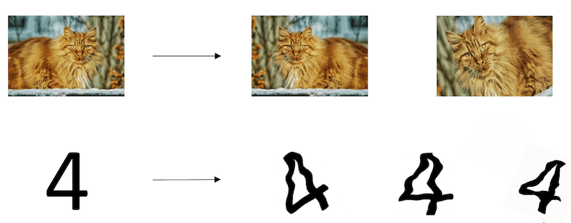
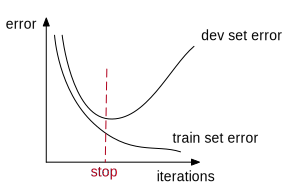

## 1. 训练/开发/测试集

（1）划分比例：

- 数据量不大（例如1W条数据）的情况下，可以按照6:2:2进行划分
- 大数据（例如100W条数据）情况下，可以按照98%，1%，1%进行划分

（2）数据分布

不同数据集应该遵循同样的数据分布。例如图片识别，一部分图片是从网上抓取的，一部分是自己实际拍摄的。那么各个数据集都应当包含这两种图片，并且比例大致相同。

## 2. 偏差/方差

偏差（bias）和方差（variance）用于衡量模型对数据的拟合程度。主要和训练集误差与开发集误差相关联。

|                 |     |     |     |      |
|-----------------|-----|-----|-----|------|
| Train set error | 1%  | 15% | 15% | 0.5% |
| Dev set error   | 11% | 16% | 30% | 1%   |
| 结果 | 高方差 | 高偏差 | 高方差，高偏差 | 低方差，低偏差 |

在高偏差情况下，通常为欠拟合，此时可以：

- 使用更复杂的神经网络结构
- 迭代更多次数
- 使用更好的优化算法

在高方差情况下，通常为过拟合，此时可以：

- 使用更多的数据来进行训练
- 正则化

## 3. 正则化

正则化用于避免过拟合。

（1）L2正则化

对于逻辑回归，令 $J(w,b)=\frac{1}{m}\sum_{i=1}^{m}\mathcal{L}(\hat{y}^{(i)},y^{(i)})+\frac{\lambda}{2m}\mid\mid{w}\mid\mid^2$。

对于神经网络，令 $J=\frac{1}{m}\sum_{i=1}^{m}\mathcal{L}(\hat{y}^{(i)},y^{(i)})+\frac{\lambda}{2m}\sum_{l=1}^{L}\mid\mid{W^{[l]}}\mid\mid^2_F$。

（2）Dropout

Dropout即随机失活，是另一种正则化方法。如上图所示，左边为原始的网络结构，在训练过程中，让一部分节点随机失活，得到右边更为简单的网络结构。

最常用的方法为反向随时失活（Inverted Dropout）：

1. 定义一个数值 $keep\text{-}prob$，表示节点保留的概率。如0.8
2. 定义 $d^{[l]}=np.random.rand(*a^{[l]}.shape)<keep\text{-}prob$
3. $a^{[l]}=a^{[l]}*d^{[l]}$
4. $a^{[l]}=a^{[l]}\div keep\text{-}prob$

上述步骤在训练阶段使用，在测试阶段则不执行dropout。

（3）数据扩增（Data augmentation）

例如对图片进行翻转、旋转、裁剪，对文字进行适当的扭曲，从而得到更多的训练数据。

（4）Early stopping

在执行梯度下降过程中，通过观察训练集误差和开发集误差的变化趋势，在过拟合之前就停止，如下图所示：

## 4. 归一化输入

如果输入特征的分布不一致，则通过归一化输入可以提高训练效率。归一化输入分为两步：

1. 零均值化
    - $\mu=\frac{1}{m}\sum_{i=1}^{m}x^{(i)}$
    - $x:=x-\mu$
2. 方差归一化
    - $\sigma^2=\frac{1}{m}\sum_{i=1}^{m}(x^{(i)})^2$
    - $x:=\frac{x}{\sigma^2}$
