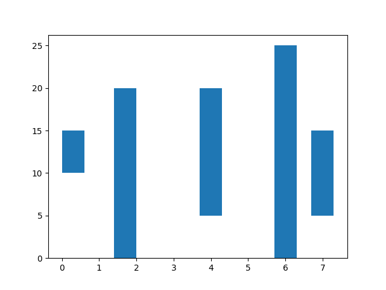
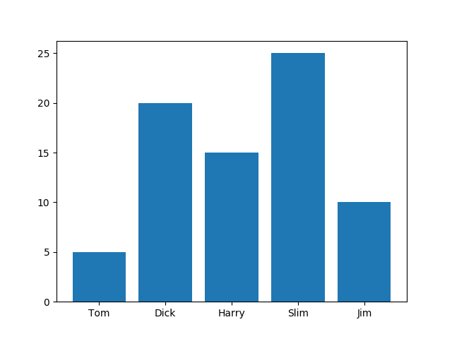
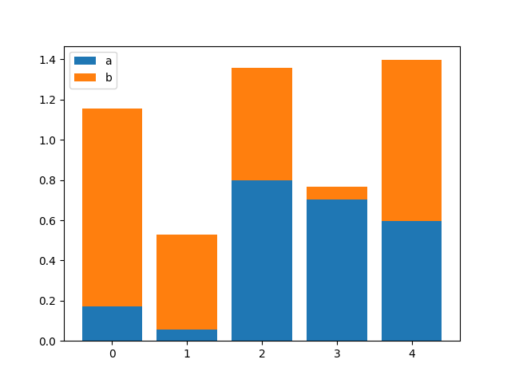
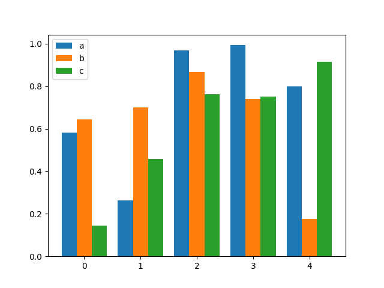
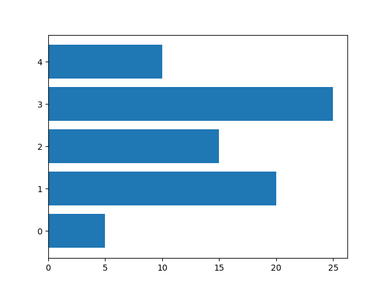
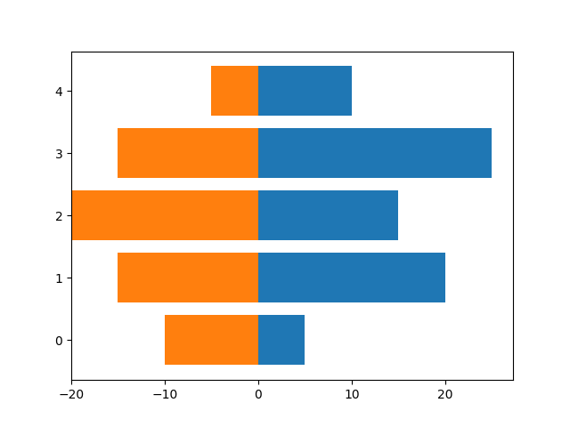

## 1. 基本的柱状图

```py
import matplotlib.pyplot as plt

data = [5, 20, 15, 25, 10]

plt.bar(range(len(data)), data)
plt.show()
```


`plt.bar`函数签名为：

```py
bar(left, height, width=0.8, bottom=None, **kwargs)
```

事实上，`left`，`height`，`width`，`bottom`这四个参数确定了柱体的位置和大小。默认情况下，`left`为柱体的居中位置（可以通过`align`参数来改变`left`值的含义），即：

- `(left - width / 2, bottom)`为左下角位置
- `(left + width / 2, bottom + height)`为右上角位置

例如：

```py
import matplotlib.pyplot as plt

data = [5, 20, 15, 25, 10]

plt.bar([0.3, 1.7, 4, 6, 7], data, width=0.6, bottom=[10, 0, 5, 0, 5])
plt.show()
```



## 2. 设置柱体样式

（1）颜色

通过`facecolor(或fc)`关键字参数可以设置柱体颜色，例如：

```py
import matplotlib.pyplot as plt

data = [5, 20, 15, 25, 10]

plt.bar(range(len(data)), data, fc='g')
plt.show()
```


通过`color`关键字参数 可以一次性设置多个颜色，例如：

```py
import matplotlib.pyplot as plt

data = [5, 20, 15, 25, 10]

plt.bar(range(len(data)), data, color='rgb') # or `color=['r', 'g', 'b']`
plt.show()
```


（2）描边

相关的关键字参数为：

- edgecolor 或 ec
- linestyle 或 ls
- linewidth 或 lw

例如：

```py
import matplotlib.pyplot as plt

data = [5, 20, 15, 25, 10]

plt.bar(range(len(data)), data, ec='r', ls='--', lw=2)
plt.show()
```


（3）填充

`hatch`关键字可用来设置填充样式，可取值为：`/`, `\`, `|`, `-`, `+`, `x`, `o`, `O`, `.`, `*`。例如：

```py
import matplotlib.pyplot as plt

data = [5, 20, 15, 25, 10]

plt.bar(range(len(data)), data, ec='k', lw=1, hatch='o')
plt.show()
```


## 3. 设置tick label

```py
import matplotlib.pyplot as plt

data = [5, 20, 15, 25, 10]
labels = ['Tom', 'Dick', 'Harry', 'Slim', 'Jim']

plt.bar(range(len(data)), data, tick_label=labels)
plt.show()
```



## 4. 堆叠柱状图

通过`bottom`参数，可以绘制堆叠柱状图。例如：

```py
import numpy as np
import matplotlib.pyplot as plt

size = 5
x = np.arange(size)
a = np.random.random(size)
b = np.random.random(size)

plt.bar(x, a, label='a')
plt.bar(x, b, bottom=a, label='b')
plt.legend()
plt.show()
```



## 5. 并列柱状图

绘制并列柱状图与堆叠柱状图类似，都是绘制多组柱体，只需要控制好每组柱体的位置和大小即可。例如：

```py
import numpy as np
import matplotlib.pyplot as plt

size = 5
x = np.arange(size)
a = np.random.random(size)
b = np.random.random(size)
c = np.random.random(size)

total_width, n = 0.8, 3
width = total_width / n
x = x - (total_width - width) / 2

plt.bar(x, a,  width=width, label='a')
plt.bar(x + width, b, width=width, label='b')
plt.bar(x + 2 * width, c, width=width, label='c')
plt.legend()
plt.show()
```



## 6. 条形图

使用`barh`方法绘制条形图。例如：

```py
import matplotlib.pyplot as plt

data = [5, 20, 15, 25, 10]

plt.barh(range(len(data)), data)
plt.show()
```



`plt.barh`方法的签名为：

```py
barh(bottom, width, height=0.8, left=None, **kwargs)
```

可以看到与`plt.bar`方法类似。因此堆积条形图和并列条形图的画法与前面类似，不做赘述。

## 7. 正负条形图

```py
import numpy as np
import matplotlib.pyplot as plt

a = np.array([5, 20, 15, 25, 10])
b = np.array([10, 15, 20, 15, 5])

plt.barh(range(len(a)), a)
plt.barh(range(len(b)), -b)
plt.show()
```


