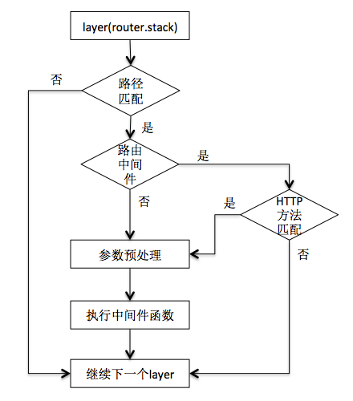

本文主要通过是对[Express](http://expressjs.com/)的一个较为深入的分析，至于对Express的源码分析，在我的[Github](https://github.com/syaning/understanding-express)上。本文的分析基于Express 4.12.3.

## 1. 理解app

在使用Express的时候，我们通过如下方式创建一个应用：

```javascript
var express = require('express');
var app = express();

app.listen(3000);
```

而在不使用框架的时候，通常的做法是：

```javascript
var http = require('http');

http.createServer(function(req, res) {
        res.write('hello world');
        res.end();
    })
    .listen(8000);
```

通过查看源码，可以发现，`express`实际上就是一个工厂函数，用来创建`app`，而`app`则就是`createServer`的回调函数。相关源码如下：

```javascript
// in express.js
function createApplication() {
  var app = function(req, res, next) {
    app.handle(req, res, next);
  };

  // ... ...

  return app;
}

// in application.js
app.listen = function(){
  var server = http.createServer(this);
  return server.listen.apply(server, arguments);
};
```

因此，在使用Express的时候，事实上，所有的请求都是交给`app`，通过`app.handle`来处理了。

通过分析application.js的源码，可以归纳出，`app`主要有如下属性和方法：

- `settings`，{}，主要是一些设置信息，相关方法有：
    - `set(setting, value)`，有`value`的时候进行设置，无`value`的时候进行获取
    - `get(setting)`
    - `enabled(setting)`
    - `disabled(setting)`
    - `enable(setting)`
    - `disable(setting)`
- `cache`，{}
- `engines`，{}，设置模版引擎，相关方法有：
    - `engine(ext, fn)`
- `locals`，{}
- `mountpath`，字符串，相关方法有：
    - `use(path, app)`，会设置`app`的`mountpath`的值
    - `path()`，获取应用的绝对路径值
- `_router`，`Router`对象，相关方法有（由于参数可以有多种形式，因此并未列出参数）：
    - `route()`，创建一条路由，会调用`Router.route`
    - `METHOD()`，创建一条路由，并调用VERB方法，会调用`Router.route`
    - `all()`，创建一条路由，并调用所有的VERB方法，会调用`Router.route`
    - `param()`，会调用`Router.param`
    - `use()`，会调用`Router.use`

## 2. Router

`app`有一个`_router`属性，事实上就是一个`Router`。`Router`相当于是一个中间件容器，存放着各种各样的中间件，大体上，可以分为路由中间件和其它中间件。`Router`的主要属性和方法有：

- `params`，{}
    - `param()`
- `_params`，[]
- `caseSensitive`，boolean
- `mergeParam`，boolean
- `strcit`，boolean
- `stack`，[]，存放着所有的中间件，相关方法有：
    - `use()`，使用中间件，本质上是向`stack`中添加一个`Layer`对象
    - `route()`，创建路由中间件，本质上是创建一个`Route`对象，并使用该`Route`对象创建一个`Layer`对象，将此`layer`对象添加到`stack`中
    - `METHOD()`，创建路由中间件，并添加处理函数，实际上是调用了`route()`方法

每个中间件都是一个`Layer`对象，`Layer`对象的基本属性有：

- `handle`，function，表示中间件函数
- `name`，string，中间件函数的名字，如果为匿名函数则为`<anonymous>`
- `params`，undefined，在执行`match`的时候赋值
- `path`，undefiend，在执行`match`的时候赋值
- `regexp`，RegExp，路径的正则表达形式
- `keys`，[]，保存的是路径中的参数及其相关的一些其它信息
- `route`，如果是路由中间件，则该属性为一个`Route`对象，否则为`undefined`。该属性不在`Layer`模块中定义，而是在`Router`模块中生成实例后定义

## 3. 路由机制

在`Router`的`stack`中，存放着多个中间件，每一个中间件都是一个`Layer`对象，如果该中间件是一个路由中间件，则相应的`Layer`对象的`route`属性会指向一个`Route`对象，表示一条路由。`Route`的主要属性和方法有：

- `path`，string，表示路径
- `stack`，[]，存放的是`Layer`对象，表示路由处理函数
- `methods`，{}，表明支持哪些HTTP方法，例如`{ get: true }`，如果使用了`all()`，则该属性值为`{ _all: true }`

需要注意的是，`Route`的`stack`与`Router`的`stack`存放的都是`Layer`对象，但是这两种`Layer`之间有少许差别，主要如下：

- 都具有`handle`，`name`，`params`，`path`，`regexp`，`keys`属性，这几个属性都是在`Layer`模块的构造函数中定义的
- `Router`中的`Layer`对象具有`route`属性，如果该属性不为`undefined`，则表明为一个路由中间件；而`Route`中的`Layer`对象没有`route`属性
- `Route`中的`Layer`对象具有`method`属性，表明该路由函数的HTTP方法；而`Router`中的`Layer`对象没有`method`属性
- `Route`中的`Layer`对象的`keys`属性值均为`[]`，`regexp`属性值均为`/^\/?$/i`，因为在`Route`模块中创建`Layer`对象时使用的是`Layer('/', {}, fn)`

创建路由的主要方法及其调用过程如下：

- `app.METHOD()` → `router.route` → `route.METHOD()`
- `app.all()` → `router.route` → `route.METHOD()`
- `app.route()` → `router.route`

例如：

```javascript
app.all('/users', function() {});
app.get('/users/:username', function() {});
app.route('/test').get(function() {}).post(function() {});
```

对于同一路径的多次路由添加会创建多条路由，例如：

```javascript
app.get('/users', function test() {});
app.get('/users', function foo() {}, function bar() {});
```

该例子会创建两条路由，其中第一条路有一个处理函数，而第二条路由有两个处理函数。

## 4. 请求处理

当请求到来时，处理过程是`app.handle` → `router.handle`，事实上，`app.handle`调用了`router.handle`，而`router.handle`的过程，则是依次对`router.stack`中存放的中间件进行调用。示例图如下：


`router.stack`中存的是一个个的`Layer`对象，用来管理中间件。如果`Layer`对象表示的是一个路由中间件，则其`route`属性会指向一个`Route`对象，而`route.stack`中存放的也是一个个的`Layer`对象，用来管理路由处理函数。

因此，当一个请求到来的时候，会依次通过`router.stack`中的`Layer`对象，如果遇到路由中间件，则会依次通过`route.stack`中的`Layer`对象。

对于`router.stack`中的每个`Layer`对象，会先判断是否匹配请求路径，如果不匹配，则跳过，继续下一个。在路径匹配的情况下，如果是非路由中间件，则执行该中间件函数；如果是路由中间件，则继续判断该中间件的路由对象能够处理请求的HTTP方法，如果不能够处理，则跳过继续下一个，如果能够处理则对`route.stack`中的`Layer`对象（与请求的HTTP方法匹配的）依次执行。示例图如下：



在中间件函数执行之前，会先对参数进行预处理，即`router.process_params`。对于每个参数的预处理只会进行一次，但是由于每个layer执行之前都会有参数预处理的过程，因此有一个缓存系统，来记录哪些参数已经处理过了。
