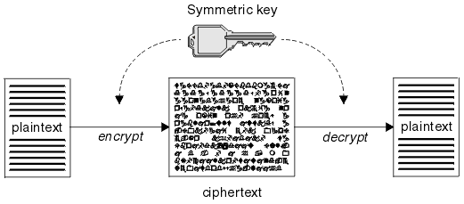
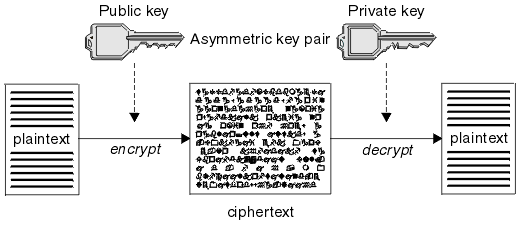
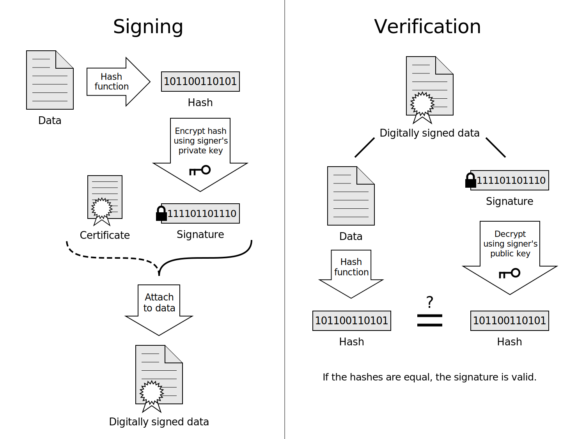

## Hash

哈希函数（散列函数）主要用于生成消息摘要(Message Digest)，即将任意大小的数据映射到一个固定大小的数据。最常见的如MD5，SHA1等。

```
---------  hash function  --------------
| input |---------------->| hash value |
---------                 --------------
```

在Node中，通过`crypto.getHashes()`可以查看所支持的哈希算法：

```js
crypto.getHashes()
// => [ 'DSA', 'DSA-SHA', 'DSA-SHA1', ... ]
```

下面是一个MD5的例子：

```js
var hash = crypto.createHash('md5')
  .update('input')
  .digest('hex')

console.log(hash)
// => a43c1b0aa53a0c908810c06ab1ff3967
```

## HMAC

在了解HMAC之前，需要先了解MAC(Message Authentication Code)，即消息认证码。

发送方使用MAC算法将消息和密钥进行计算，得到MAC值，然后将消息和MAC值发送出去。接收方拿到数据后，通过相同的MAC算法把消息和密钥进行计算，和收到的MAC值进行比较。如果一致，则说明消息在发送过程中没有被篡改。


> 图片来源：[https://upload.wikimedia.org/wikipedia/commons/0/08/MAC.svg](https://upload.wikimedia.org/wikipedia/commons/0/08/MAC.svg)

HMAC即Hash-based Message Authentication Code，即使用一个Hash函数作为MAC算法。例如：

```js
var hmac = crypto.createHmac('sha256', 'secret')
  .update('message')
  .digest('hex')

console.log(hmac)
// => 8b5f48702995c1598c573db1e21866a9b825d4a794d169d7060a03605796360b
```

[cookie-signature](https://github.com/tj/node-cookie-signature)中对cookie签名用的就是HMAC实现。

## Cipher & Decipher

Cipher用于加密，Decipher用于解密。加密分为对称加密和非对称加密。

对称加密指的是加密和解密使用相同的密钥。例如A向B发消息，A使用密钥进行加密发送给B，B收到密文后使用相同的密钥进行解密从而得到消息明文。由于加密和解密使用的是相同的密钥，因此加入密钥泄露，那么别人截获了消息同样可以进行解密。



> 图片来源：[http://www.ibm.com/support/knowledgecenter/SSFKSJ_7.1.0/com.ibm.mq.doc/sy10500_.htm](http://www.ibm.com/support/knowledgecenter/SSFKSJ_7.1.0/com.ibm.mq.doc/sy10500_.htm)

下面是一个使用aes256算法（对称加密）的例子：

```js
var cipher = crypto.createCipher('aes256', 'password')
var encrypted = cipher.update('input', 'utf8', 'hex')
encrypted += cipher.final('hex')

console.log(encrypted)
// => fcfb38e53f2400797beb819795f6a459

var decipher = crypto.createDecipher('aes256', 'password')
var decrypted = decipher.update(encrypted, 'hex', 'utf8')
decrypted += decipher.final('utf8')

console.log(decrypted)
// => input
```

非对称加密指的是加密和解密使用不同的密钥。通常会有一对公钥和私钥，经过公钥加密的消息只有使用私钥才能解密，经过私钥加密的消息只有经过公钥才能解密。例如A向B发消息，A使用B的公钥加密消息发送出去，B收到密文后使用自己的私钥进行解密。由于B的私钥只有B拥有，因此如果别人截获了密文，也是无法解析的。



> 图片来源：[http://www.ibm.com/support/knowledgecenter/SSFKSJ_7.1.0/com.ibm.mq.doc/sy10500_.htm](http://www.ibm.com/support/knowledgecenter/SSFKSJ_7.1.0/com.ibm.mq.doc/sy10500_.htm)

下面是使用rsa非对称加密的例子：

首先通过openssl来生成一对密钥：

```sh
$ openssl genrsa -out rsa_private.key 2048
$ openssl rsa -pubout -in rsa_private.key -out rsa_public.key
```

然后是加密和解密：

```js
const publicKey = fs.readFileSync('./key/rsa_public.key')
const privateKey = fs.readFileSync('./key/rsa_private.key')

var data = 'hello world'
var encryptedData
var decryptedData

// encrypt with public key and decrypt with private key
encryptedData = crypto.publicEncrypt(publicKey, Buffer.from(data)).toString('hex')
decryptedData = crypto.privateDecrypt(privateKey, Buffer.from(encryptedData, 'hex')).toString('utf8')
console.log(encryptedData) // 0a31e457f15526230d044bbeb711ec05b97d9f009...
console.log(decryptedData) // hello world

// encrypt with private key and decrypt with public key
encryptedData = crypto.privateEncrypt(privateKey, Buffer.from(data)).toString('hex')
decryptedData = crypto.publicDecrypt(publicKey, Buffer.from(encryptedData, 'hex')).toString('utf8')
console.log(encryptedData) // c116c5b501309251cb273bde20e8aa7abe6f4edff...
console.log(decryptedData) // hello world
```

## Sign & Verify

Sign用于数字签名，Verify用于验证签名。数字签名原理如图：



> 图片来源：[https://upload.wikimedia.org/wikipedia/commons/2/2b/Digital_Signature_diagram.svg](https://upload.wikimedia.org/wikipedia/commons/2/2b/Digital_Signature_diagram.svg)

在之前的非对称加密中，使用公钥进行加密，私钥进行解密。在生成和验证数字签名的时候，会使用私钥进行签名，公钥进行验证。

通过openssl来生成一对密钥：

```sh
$ openssl genrsa -out rsa_private.key 2048
$ openssl rsa -pubout -in rsa_private.key -out rsa_public.key
```

下面是一个签名及验证的例子：

```js
const sign = crypto.createSign('RSA-SHA256')
sign.update('input')
const private_key = fs.readFileSync('rsa_private.key', 'utf8')
const signature = sign.sign(private_key, 'hex')
console.log(signature)
// => b9b339491522843e11cf0cc4a2de1ccccc2bff7d0......

const verify = crypto.createVerify('RSA-SHA256')
verify.update('input')
const public_key = fs.readFileSync('rsa_public.key', 'utf8')
console.log(verify.verify(public_key, signature, 'hex'))
// => true
```
