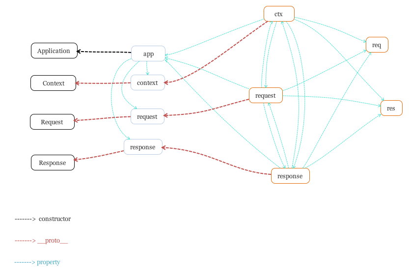

::: tip
本文基于[Koa v2.0.0](https://github.com/koajs/koa/tree/2.0.0)。
:::

## 1. Koa vs Express

[Koa](http://koajs.com/)是继[Express](http://expressjs.com/)之后，Node的又一主流Web开发框架。相比于Express，Koa只保留了核心的中间件处理逻辑，去掉了路由，模板，以及其他一些功能。详细的比较可以参考[Koa vs Express](https://github.com/koajs/koa/blob/master/docs/koa-vs-express.md)。

另一方面，在中间件的处理过程中，Koa和Express也有着一定区别，看下面例子：

```js
// http style
http.createServer((req, res) => {
  // ...
})

// express style
app.use((req, res, next) => {
  // ...
})

// koa style
app.use((ctx, next) => {
  // ...
})
```

Node自带的`http`模块处理请求的时候，参数是一个`req`和`res`，分别为`http.IncomingMessage`和`http.ServerResponse`的实例。

Express对请求参数`req`和`res`的原型链进行了扩展，增强了`req`和`res`的行为。

而Koa并没有改变`req`和`res`，而是通过`req`和`res`封装了一个`ctx (context)`对象，进行后面的逻辑处理。

关于Express的深入解读，可以参考之前的博文：

- [深入理解Express](./2015-05-20-dive-into-express-1)
- [深入理解Express(2)](./2015-06-16-dive-into-express-2)
- [Express深入解读](./2015-10-22-express-in-depth)

## 2. Koa基本组成

Koa源码非常精简，只有四个文件：

- `application.js`：Application(或Koa)负责管理中间件，以及处理请求
- `context.js`：Context维护了一个请求的上下文环境
- `request.js`：Request对`req`做了抽象和封装
- `response.js`：Response对`res`做了抽象和封装

## 3. Application

Application主要维护了中间件以及其它一些环境：

```js
// application.js
module.exports = class Application extends Emitter {
  constructor() {
    super();

    this.proxy = false;
    this.middleware = [];
    this.subdomainOffset = 2;
    this.env = process.env.NODE_ENV || 'development';
    this.context = Object.create(context);
    this.request = Object.create(request);
    this.response = Object.create(response);
  }

  // ...
}
```

通过`app.use(fn)`可以将`fn`添加到中间件列表`this.middleware`中。

`app.listen`方法源码如下：

```js
// application.js
listen() {
  debug('listen');
  const server = http.createServer(this.callback());
  return server.listen.apply(server, arguments);
}
```

首先会通过`this.callback`方法来返回一个函数作为`http.createServer`的回调函数，然后进行监听。我们已经知道，`http.createServer`的回调函数接收两个参数：`req`和`res`，下面来看`this.callback`的实现：

```js
// application.js
callback() {
  const fn = compose(this.middleware);

  if (!this.listeners('error').length) this.on('error', this.onerror);

  return (req, res) => {
    res.statusCode = 404;
    const ctx = this.createContext(req, res);
    onFinished(res, ctx.onerror);
    fn(ctx).then(() => respond(ctx)).catch(ctx.onerror);
  };
}
```

首先是将所有的中间件通过[`compose`](https://github.com/koajs/compose)组合成一个函数`fn`，然后返回`http.createServer`所需要的回调函数。于是我们可以看到，当服务器收到一个请求的时候，会使用`req`和`res`通过`this.createContext`方法来创建一个上下文环境`ctx`，然后使用`fn`来进行中间件的逻辑处理。

## 4. Context

通过上面的分析，我们已经可以大概得知Koa处理请求的过程：当请求到来的时候，会通过`req`和`res`来创建一个`context (ctx)`，然后执行中间件。

事实上，在创建`context`的时候，还会同时创建`request`和`response`，通过下图可以比较直观地看到所有这些对象之间的关系。



图中：

- 最左边一列表示每个文件的导出对象
- 中间一列表示每个Koa应用及其维护的属性
- 右边两列表示对应每个请求所维护的一些对象
- 黑色的线表示实例化
- 红色的线表示原型链
- 蓝色的线表示属性

实际上，`ctx`主要的功能是代理`request`和`response`的功能，提供了对`request`和`response`对象的便捷访问能力。在源码中，我们可以看到：

```js
// context.js
delegate(proto, 'response')
  .method('attachment')
  // ...
  .access('status')
  // ...
  .getter('writable');

delegate(proto, 'request')
  .method('acceptsLanguages')
  // ...
  .access('querystring')
  // ...
  .getter('ip');
```

这里使用了[delegates](https://github.com/tj/node-delegates)模块来实现属性访问的代理。简单来说，通过`delegate(proto, 'response')`，当访问`proto`的代理属性的时候，实际上是在访问`proto.response`的对应属性。

## 5. Request & Response

Request对`req`进行了抽象和封装，其中对于请求的url相关的处理如图：

```
┌────────────────────────────────────────────────────────┐
│                           href                         │
├────────────────────────────┬───────────────────────────┤
│          origin            │     url / originalurl     │
├──────────┬─────────────────┼──────────┬────────────────┤
│ protocol │      host       │   path   │     search     │
├──────────├──────────┬──────┼──────────┼─┬──────────────┤
│          │ hostname │ port │          │?│ querystring  │
│          ├──────────┼──────┤          ├─┼──────────────┤
│          │          │      │          │ │              │
"  http:   │ host.com : 8080   /p/a/t/h  ?  query=string │
│          │          │      │          │ │              │
└──────────┴──────────┴──────┴──────────┴─┴──────────────┘
```

Response对`res`进行了封装和抽象，这里不做赘述。

## 6. 中间件的执行

在上面已经提到，所有的中间件会经过[compose](https://github.com/koajs/compose)处理，返回一个新的函数。该模块源码如下：

```js
function compose(middleware) {
  // 错误处理
  if (!Array.isArray(middleware)) throw new TypeError('Middleware stack must be an array!')
  for (const fn of middleware) {
    if (typeof fn !== 'function') throw new TypeError('Middleware must be composed of functions!')
  }

  return function(context, next) {
    // last called middleware #
    let index = -1
    return dispatch(0)

    function dispatch(i) {
      if (i <= index) return Promise.reject(new Error('next() called multiple times'))
      // 当前执行第 i 个中间件
      index = i
      let fn = middleware[i]
      // 所有的中间件执行完毕
      if (i === middleware.length) fn = next
      if (!fn) return Promise.resolve()

      try {
        // 执行当前的中间件
        // 这里的fn也就是app.use(fn)中的fn
        return Promise.resolve(fn(context, function next() {
          return dispatch(i + 1)
        }))
      } catch (err) {
        return Promise.reject(err)
      }
    }
  }
}
```

Koa的中间件支持普通函数，返回一个Promise的函数，以及async函数。由于generator函数中间件在新的版本中将不再支持，因此不建议使用。
