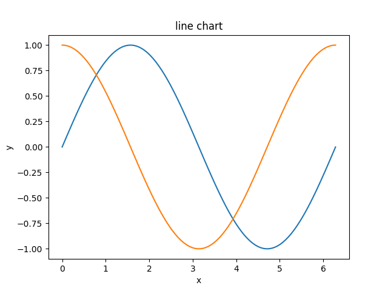
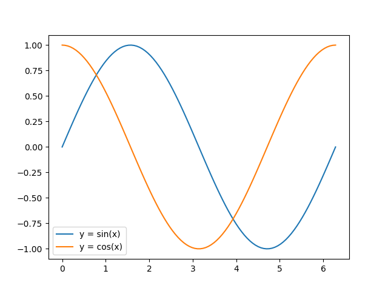
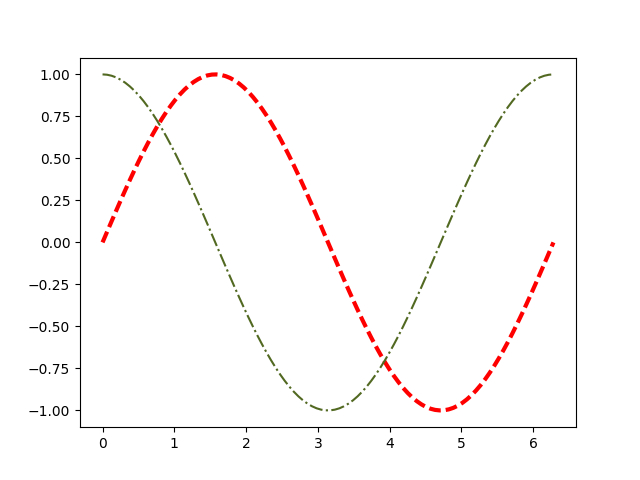
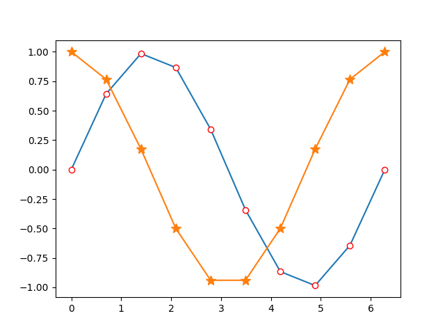
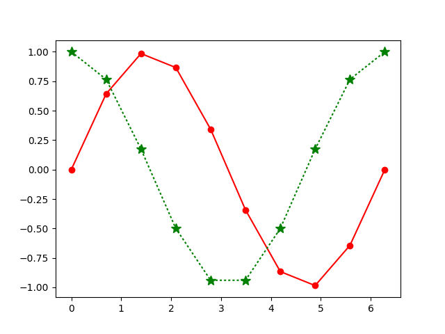

## 1. line chart

```py
import numpy as np
import matplotlib.pyplot as plt

x = np.linspace(0, 2 * np.pi, 100)
y1, y2 = np.sin(x), np.cos(x)

plt.plot(x, y1)
plt.plot(x, y2)

plt.title('line chart')
plt.xlabel('x')
plt.ylabel('y')

plt.show()
```



## 2. 图例

在`plot`的时候指定`label`，然后调用`legend`方法可以绘制图例。例如：

```py
import numpy as np
import matplotlib.pyplot as plt

x = np.linspace(0, 2 * np.pi, 100)
y1, y2 = np.sin(x), np.cos(x)

plt.plot(x, y1, label='y = sin(x)')
plt.plot(x, y2, label='y = cos(x)')
plt.legend()
plt.show()
```



`legend`方法可接受一个`loc`关键字参数来设定图例的位置，可取值为数字或字符串：

- 0: 'best'
- 1: 'upper right'
- 2: 'upper left'
- 3: 'lower left'
- 4: 'lower right'
- 5: 'right'
- 6: 'center left'
- 7: 'center right'
- 8: 'lower center'
- 9: 'upper center'
- 10: 'center'

## 3. 线的样式

（1）颜色

`plot`方法的关键字参数`color(或c)`用来设置线的颜色。可取值为：

- 颜色名称或简写
    + b: blue
    + g: green
    + r: red
    + c: cyan
    + m: magenta
    + y: yellow
    + k: black
    + w: white
- #rrggbb
- (r, g, b) 或 (r, g, b, a)，其中 r g b a 取均为[0, 1]之间
- [0, 1]之间的浮点数的字符串形式，表示灰度值。0表示黑色，1表示白色

（2）样式

`plot`方法的关键字参数`linestyle(或ls)`用来设置线的样式。可取值为：

- `-`, `solid`
- `--`, `dashed`
- `-.`, `dashdot`
- `:`, `dotted`
- `''`, `' '`, `None`

（3）粗细

设置`plot`方法的关键字参数`linewidth(或lw)`可以改变线的粗细，其值为浮点数。

```py
import numpy as np
import matplotlib.pyplot as plt

x = np.linspace(0, 2 * np.pi, 100)
y1, y2 = np.sin(x), np.cos(x)

plt.plot(x, y1, c='r', ls='--', lw=3)
plt.plot(x, y2, c='#526922', ls='-.')
plt.show()
```



## 4. marker

以下关键字参数可以用来设置marker的样式：

- marker
- markeredgecolor 或 mec
- markeredgewidth 或 mew
- markerfacecolor 或 mfc
- markerfacecoloralt 或 mfcalt
- markersize 或 ms

其中`marker`可取值为：

- `'.'`: point marker
- `','`: pixel marker
- `'o'`: circle marker
- `'v'`: triangle_down marker
- `'^'`: triangle_up marker
- `'<'`: triangle_left marker
- `'>'`: triangle_right marker
- `'1'`: tri_down marker
- `'2'`: tri_up marker
- `'3'`: tri_left marker
- `'4'`: tri_right marker
- `'s'`: square marker
- `'p'`: pentagon marker
- `'*'`: star marker
- `'h'`: hexagon1 marker
- `'H'`: hexagon2 marker
- `'+'`: plus marker
- `'x'`: x marker
- `'D'`: diamond marker
- `'d'`: thin_diamond marker
- `'|'`: vline marker
- `'_'`: hline marker

例如：

```py
import numpy as np
import matplotlib.pyplot as plt

x = np.linspace(0, 2 * np.pi, 10)
y1, y2 = np.sin(x), np.cos(x)

plt.plot(x, y1, marker='o', mec='r', mfc='w')
plt.plot(x, y2, marker='*', ms=10)
plt.show()
```



另外，`marker`关键字参数可以和`color`以及`linestyle`这两个关键字参数合并为一个字符串。例如：

```py
import numpy as np
import matplotlib.pyplot as plt

x = np.linspace(0, 2 * np.pi, 10)
y1, y2 = np.sin(x), np.cos(x)

plt.plot(x, y1, 'ro-')
plt.plot(x, y2, 'g*:', ms=10)
plt.show()
```


