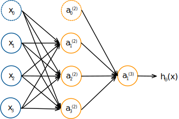
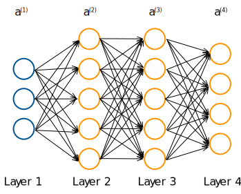

## 1. Neural Network

- $a_i^{(j)}$：第 $j$ 层的第 $i$ 个单元
- $\Theta^{(j)}$：第 $j$ 层到第 $j+1$ 层映射的权重矩阵

$$
\begin{array}{}
a_1^{(2)}=g(\Theta_{10}^{(1)}x_0+\Theta_{11}^{(1)}x_1+\Theta_{12}^{(1)}x_2+\Theta_{13}^{(1)}x_3) \\
a_2^{(2)}=g(\Theta_{20}^{(1)}x_0+\Theta_{21}^{(1)}x_1+\Theta_{22}^{(1)}x_2+\Theta_{23}^{(1)}x_3) \\
a_3^{(2)}=g(\Theta_{30}^{(1)}x_0+\Theta_{31}^{(1)}x_1+\Theta_{32}^{(1)}x_2+\Theta_{33}^{(1)}x_3) \\
h_\Theta(x)=a_1^{(3)}=g(\Theta_{10}^{(2)}a_0^{(2)}+\Theta_{11}^{(2)}a_1^{(2)}+\Theta_{12}^{(2)}a_2^{(2)}+\Theta_{13}^{(2)}a_3^{(2)}) \\
\end{array}
$$

假设第 $j$ 层单元数为 $s_j$（不包括偏置单元），第 $j+1$ 层单元数为 $s_{j+1}$，则 $\Theta_j \in s_{j+1}\times(s_j+1)$。

## 2. Cost Function

- $L$：总层数
- $s_l$：第 $l$ 层的单元数（不包括偏置单元）
- $m$：样本个数
- $K$：输出单元数

$$ J(\Theta)=-\frac{1}{m}\sum_{i=1}^{m}\sum_{k=1}^{K}[y_k^{(i)}log(h_\Theta(x^{(i)}))_k+(1-y_k^{(i)})log(1-(h_\Theta(x^{(i)}))_k)]+\frac{\lambda}{2m}\sum_{l=1}^{L-1}\sum_{i=1}^{s_l}\sum_{j=1}^{s_{l+1}}(\Theta_{ji}^{(l)})^2 $$

## 3. Backpropagation

假设只有一个样本 $(x,y)$ 的情况，神经网络如下：

在 forward propagation 阶段：

$$
\begin{array}{}
a^{(1)} = x \\
z^{(2)} = \Theta^{(1)}a^{(1)} \\
a^{(2)} = g(z^{(2)}) \space\space\space\space (add \space a_0^{(2)}) \\
z^{(3)} = \Theta^{(2)}a^{(2)} \\
a^{(3)} = g(z^{(3)}) \space\space\space\space (add \space a_0^{(3)}) \\
z^{(4)} = \Theta^{(3)}a^{(3)} \\
a^{(4)} = h_\Theta(x) = g(z^{(4)}) \\
\end{array}
$$

在 backpropagation 阶段，令 $\delta_j^{(l)}$ 表示第 $l$ 层第 $j$ 个节点的误差，则：

$$
\begin{array}{}
\delta^{(4)}=a^{(4)}-y \\
\delta^{(3)}=(\Theta^{(3)})^T\delta^{(4)}.*g'(z^{(3)}) \\
\delta^{(2)}=(\Theta^{(2)})^T\delta^{(3)}.*g'(z^{(2)}) \\
No \space \delta^{(1)} \\
\end{array}
$$

其中 $g'(z^{(l)})=a^{(l)}(1-a^{(l)})$ （sigmoid函数求导）。

::: tip 推导过程
对于隐藏层：

$$ \delta_i^{(l)}=\frac{\partial J}{\partial z_i^{(l)}}=\frac{\partial J}{\partial a_i^{(l)}}\frac{\partial a_i^{(l)}}{\partial z_i^{(l)}} $$

其中：

$$
\begin{array}{}
\frac{\partial J}{\partial a_i^{(l)}} &= \frac{\partial J}{\partial z_1^{(l+1)}}\frac{\partial z_1^{(l+1)}}{\partial a_i^{(l)}} + \frac{\partial J}{\partial z_2^{(l+1)}}\frac{\partial z_2^{(l+1)}}{\partial a_i^{(l)}} +...+  \frac{\partial J}{\partial z_{s_{l+1}}^{(l+1)}}\frac{\partial z_{s_{l+1}}^{(l+1)}}{\partial a_i^{(l)}} \\
&= \sum_{j=1}^{s_{l+1}}\frac{\partial J}{\partial z_j^{(l+1)}}\frac{\partial z_j^{(l+1)}}{\partial a_i^{(l)}} \\
&= \sum_{j=1}^{s_{l+1}}\frac{\partial J}{\partial z_j^{(l+1)}}\Theta_{ji}^{(l)} \\
&= \sum_{j=1}^{s_{l+1}}\delta_j^{(l+1)}\Theta_{ji}^{(l)} \\
\frac{\partial a_i^{(l)}}{\partial z_i^{(l)}} &= a_i^{(l)}(1-a_i^{(l)})
\end{array}
$$

因此：

$$ \delta_i^{(l)}=(\sum_{j=1}^{s_{l+1}}\delta_j^{(l+1)}\Theta_{ji}^{(l)})a_i^{(l)}(1-a_i^{(l)}) $$

所以：

$$ \delta^{(l)}=(\Theta^{(l)})^T\delta^{(l+1)}.*a^{(l)}.*(1-a^{(l)}) $$
:::

有了上面的推导之后，可以得到：

$$ \frac{\partial}{\partial\Theta_{ij}^{(l)}}J(\Theta)=\frac{\partial J(\Theta)}{\partial z_i^{(l+1)}}\frac{\partial z_i^{(l+1)}}{\partial\Theta_{ij}^{(l)}}=\delta_i^{(l+1)}a_j^{(l)} $$

## 4. 直观理解

在 forward propagation 阶段：

$$ a_1^{(3)}=g(\Theta_{11}^{(2)}a_1^{(2)}+\Theta_{12}^{(2)}a_2^{(2)}) $$

在 backpropagation 阶段:

$$ \delta_1^{(2)}=\Theta_{11}^{(2)}\delta_1^{(3)}+\Theta_{21}^{(2)}\delta_2^{(3)} $$

::: tip
这里只是一个直观的解释，因此并未考虑偏置单元 $a_0^{(2)}$ 以及 $\frac{\partial a_1^{(2)}}{\partial z_1^{(2)}}$。
:::
