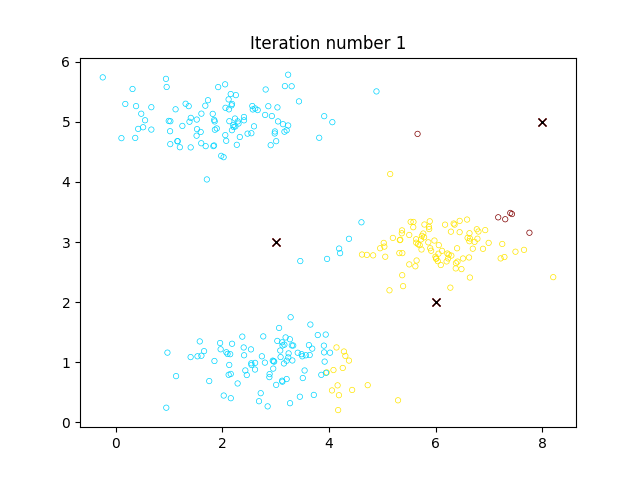
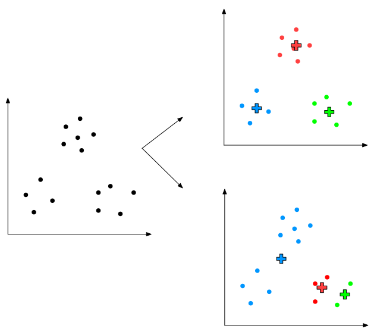

## 1. K-Means

K-Means 是一种聚类算法，属于无监督学习。其算法非常简单。

输入是：

- 聚类数 $K$
- 样本 $x^{(1)},x^{(2)},...,x^{(m)}$

算法过程：

1. 随机初始化 $K$ 个聚类的中心点 $\mu_1,\mu_2,...,\mu_K$
2. 重复如下过程：
    1. 对于每个样本，选择离该样本最近的聚类中心点 $\mu_k$，将该样本标记为第 $k$ 类
    2. 对于每个聚类，更新该聚类的中心点 $\mu_k$ 为所有该聚类的点的中心

可视化过程如图：

## 2. 优化目标

令：

- $c^{(i)}$ 表示第 $i$ 个样本当前所属聚类（$c^{(i)}$ 可取值为 $1,2,...,K$ ）
- $\mu_k$ 表示第 $k$ 个聚类的中心
- $\mu_{c^{(i)}}$ 表示第 $i$ 个样本当前所属聚类的中心

则代价函数：

$$ J(c^{(1)},...,c^{(m)},\mu_1,...,\mu_K)=\frac{1}{m}\sum_{i=1}^{m}{\Vert}x^{(i)}-\mu_{c^{(i)}}\Vert^2 $$

因此需要：

$$ \underset{c^{(1)},...,c^{(m)},\mu_1,...,\mu_K}{min}J(c^{(1)},...,c^{(m)},\mu_1,...,\mu_K) $$

通过分析上面的算法过程，不难发现：

- 2.1 其实就是在保持 $\mu_1,...,\mu_K$ 不变的情况下，通过调整 $c^{(1)},...,c^{(m)}$，来使 $J(c^{(1)},...,c^{(m)},\mu_1,...,\mu_K)$ 减小
- 2.2 其实就是在保持 $c^{(1)},...,c^{(m)}$ 不变的情况下，通过调整 $\mu_1,...,\mu_K$，来使 $J(c^{(1)},...,c^{(m)},\mu_1,...,\mu_K)$ 减小

## 3. 初始化聚类中心

通常会从样本中随机选择 $K$ 个作为初始的聚类中心。但是不同的初始化可能导致不同的结果。例如：

也就是说，有可能只是得到了局部最优，而没有得到全局最优。

一个可行的方法是：多次随机初始化聚类中心，然后运行 K-Means 算法，得到 $J(c^{(1)},...,c^{(m)},\mu_1,...,\mu_K)$，然后选取最小的 $J(c^{(1)},...,c^{(m)},\mu_1,...,\mu_K)$。

## 4. 选择聚类数目

至于聚类数目 $K$ 的选定，有如下方法：

- 肘部法则 (Elbow Method)
- 人工手动设定

“肘部法则”即通过 $K$ 和 $J(c^{(1)},...,c^{(m)},\mu_1,...,\mu_K)$ 的关系图，来找到明显的拐点（如下图左 $K=3$），但是有时候并没有明显的拐点（如下图右）。在实际场景中，很多情况下是根据聚类后的数据需求，来人工手动设置聚类数目。

