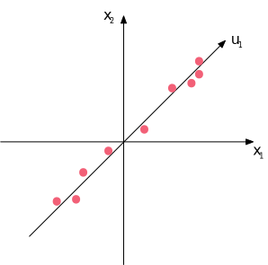
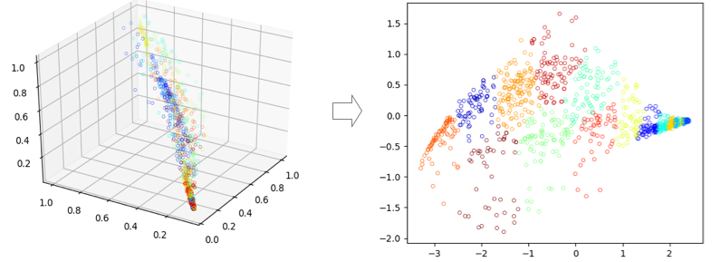
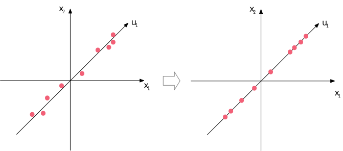

## 1. 维数约减

有时候样本的特征数有许多，其中会有一些冗余的特征。因此需要通过维数约减（Dimensionality Reduction）用更少的特征来表示样本。好处是：

- 节省计算资源
- 提高算法运行速度

例如将二维数据 $x_1,x_2$ 用一维数据 $u_1$ 来表示：

将三维数据映射到二维：

## 2. PCA

PCA 即主成分分析（Principal Component Analysis），是维数约减常用的一种方法。

首先是对数据进行预处理：

1. 使每个特征的平均值为0，即对于每个特征，计算 $\mu_j=\frac{1}{m}\sum_{i=1}^{m}x_j^{(i)}$，然后令 $x_j^{(i)}:=x_j^{(i)}-\mu_j$
2. 如果不同特征之间的数量级差别很大，还需要进行特征缩放，参考线性回归的特征标准化

然后要将 $n$ 维数据约减为 $k$ 维:

首先求协方差矩阵：

$$ \Sigma=\frac{1}{m}\sum_{i=1}^{m}(x^{(i)})(x^{(i)})^T=\frac{1}{m}X^TX $$

可以得知协方差矩阵 $\Sigma$ 是一个 $n{\times}n$ 的对称矩阵。

接下来求该协方差矩阵的特征向量，使用 svd （Singular Value Decomposition，即奇异值分解）：

$$ U,S,V=svd(\Sigma) $$

得到的 $U$ 是一个 $n{\times}n$ 的矩阵：

$$
U=\left[\begin{array}{}
|&|&&| \\
u^{(1)}&u^{(2)}&...&u^{(n)}\\
|&|&&| \\
\end{array}\right]
\in R^{n \times n}
$$

选取 $U$ 的前 $k$ 列，记作：

$$
U_{reduce}=\left[\begin{array}{}
|&|&&| \\
u^{(1)}&u^{(2)}&...&u^{(k)}\\
|&|&&| \\
\end{array}\right]
\in R^{n \times k}
$$

记维度约减后每个样本为 $z^{(i)}$，则：

$$ z^{(i)}=U_{reduce}^Tx^{(i)} $$

即：

$$ Z=XU_{reduce} $$

## 3. Reconstruction

通过上面的步骤将数据进行了压缩，同样，可以通过逆向流程来恢复数据。由于：

$$ Z=XU_{reduce} $$

因此：

$$ X_{approx}=ZU_{reduce}^T $$

之所以用 $X_{approx}$，是因为恢复后的数据会有一定的误差。如下图所示，左边为原始数据，右边为恢复后的数据。

## 4. 选择主成分数量

约减后的维度数 $k$ 又称为主成分数量。那么应该如何选择 $k$ 呢？选择最小的 $k$，使得：

$$ \frac{\frac{1}{m}\sum_{i=1}^{m}{\Vert}x^{(i)}-x_{approx}^{(i)}\Vert^2}{\frac{1}{m}\sum_{i=1}^{m}{\Vert}x^{(i)}\Vert^2}\leq0.01 $$

这里选择0.01，可以保证99%的差异性得以保留。

但是如果从 $k=1$ 开始，逐个尝试的话，效率会很低。考虑到之前求协方差矩阵的特征向量的时候：

$$ U,S,V=svd(\Sigma) $$

此处 $S$ 是一个对角矩阵：

$$
S=\begin{bmatrix}
  S_{11} & & \\
  & \ddots & \\
  & & S_{nn}
\end{bmatrix}
\in R^{n \times n}
$$

并且：

$$ \frac{\frac{1}{m}\sum_{i=1}^{m}{\Vert}x^{(i)}-x_{approx}^{(i)}\Vert^2}{\frac{1}{m}\sum_{i=1}^{m}{\Vert}x^{(i)}\Vert^2}=1-\frac{\sum_{i=1}^{k}S_{ii}}{\sum_{i=1}^{n}S_{ii}} $$

因此找到最小的 $k$，使得：

$$ \frac{\sum_{i=1}^{k}S_{ii}}{\sum_{i=1}^{n}S_{ii}}\geq0.99 $$
