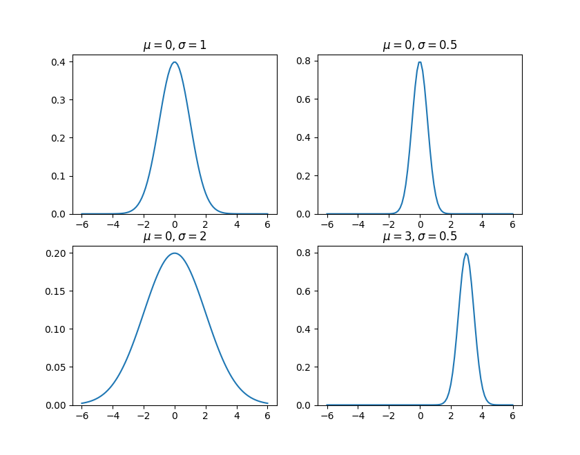
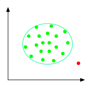
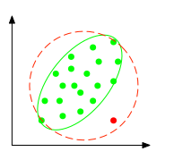

## 1. 正态分布（高斯分布）

假设对于一组数据 $x{\in}R$，如果它们满足正态分布，且平均数为 $\mu$，方差为 $\sigma^2$，则记作：

$$ x \sim N(\mu,\sigma^2) $$

概率密度函数为：

$$ p(x;\mu,\sigma^2)=\frac{1}{\sqrt{2\pi}\sigma}e^{-\frac{(x-\mu)^2}{2\sigma^2}} $$

图像如下：

如果 $\mu=0,\sigma=1$，则为标准正态分布。

## 2. 异常检测

假设有 $m$ 个样本，每个样本有 $n$ 个特征。在每个特征符合独立的正态分布的情况下，首先计算：

$$
\begin{array}{}
\mu_j=\frac{1}{m}\sum_{i=1}^{m}x_j^{(i)} \\
\sigma_j^2=\frac{1}{m}\sum_{i=1}^{m}(x_j^{(i)}-\mu_j)^2 \\
\end{array}
$$

则：

$$ p(x)=\prod_{j=1}^{n}p(x_j;\mu_j,\sigma_j^2)=\prod_{j=1}^{n}\frac{1}{\sqrt{2\pi}\sigma_j}e^{-\frac{(x_j-\mu_j)^2}{2\sigma_j^2}} $$

若 $p(x)<\varepsilon$（其中 $\varepsilon$ 是一个给定的较小的值），则认为该样本属于异常点。

如果一个特征不符合正态分布的话，需要做一些处理，使其基本符合正态分布。比如：

$$
\begin{array}{}
x_j{\leftarrow}log(x_j+c) \\
x_j{\leftarrow}x_j^c \\
... \\
\end{array}
$$

## 3. 多元高斯分布

上面的方法是假设所有的特征都符合相对独立的正态分布。如图所示：

然而事实上，许多情况下，不同特征之间是有着一定的关系的，并不是完全独立，因此上面的方法不再适用。如下图所示：

如果按照特征相对独立的方式来检测异常，将会是红色的圈，那么检测不到红色的点为异常。然而实际上应该是绿色的圈，这样才能检测到红色的点为异常。

此时需要计算协方差。即：

$$
\begin{array}{}
\mu=\frac{1}{m}\sum_{i=1}^{m}x^{(i)} \\
\Sigma=\frac{1}{m}\sum_{i=1}^{m}(x^{(i)}-\mu)(x^{(i)}-\mu)^T
\end{array}
$$

然后：

$$ p(x)=\frac{1}{(2\pi)^{\frac{n}{2}}\vert\Sigma\vert^{\frac{1}{2}}}e^{-\frac{1}{2}(x-\mu)^T\Sigma^{-1}(x-\mu)} $$
