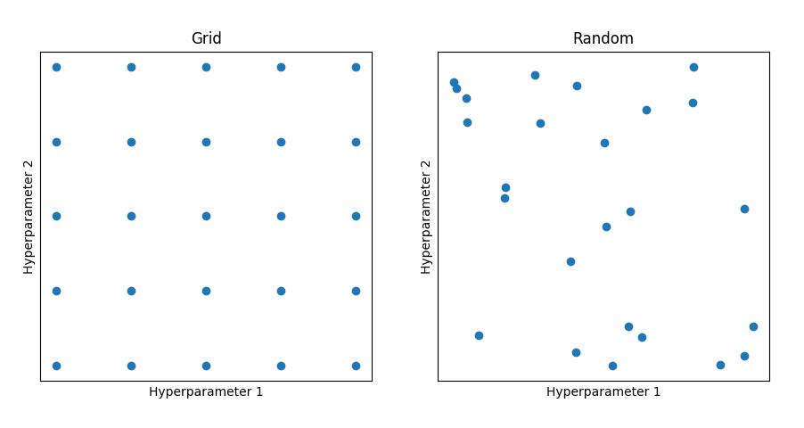
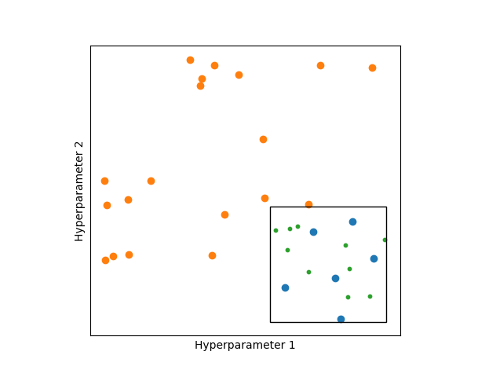

## 1. 超参数

到目前为止，已经涉及到了许多个超参数：

- 学习速率 $\alpha$
- Momentum优化算法的 $\beta$
- Adam优化算法的 $\beta_1,\beta_2,\epsilon$
- 网络层数 $L$
- 每个隐藏层的神经单元个数
- 学习率衰减 $decay\text{-}rate$
- $batch\text{-}size$

不同的超参数的重要性也不尽相同，例如：

- $\alpha$ 极为重要，需要不断调试
- $\beta$，神经单元个数，以及 $batch\text{-}size$ 也需要进行适当的调试
- 其次是 $L,decay\text{-}rate$
- $\beta_1,\beta_2,\epsilon$ 则通常使用默认值

## 2. 超参数取样原则

（1）网格取样和随机取样

如下图所示，在选择超参数的时候，有两种取样方式：网格和随机。

网格取样存在的一个问题是：如果超参数1比较重要，而超参数2不那么重要，那么在尝试了25个点之后，超参数1只取了5个值进行尝试，显然是比较浪费的。所以更好的方式是进行随机取样，从而尝试重要超参数的更多的可能值。

（2）范围由粗到细

如图所示，最开始选择较大的范围对超参数进行取样（图中橙色和蓝色的点），然后针对表现较好的取样点（蓝色的点）圈定更小的范围，生成更多的取样点（绿色的点）。

## 3. 超参数范围选择

针对不同的超参数，应当选取不同的策略来进行范围选择。

例如对网络层数 $L$，可以在2~5之间均匀选择，尝试2，3，4，5。但是对于学习速率 $\alpha$，假设要尝试的最小值是0.0001，最大值是1，那么如果在0.0001和1之间进行均匀随机选择，则会有90%的数据落在0.1到1之间，而0.0001到0.1之间，虽然相差三个数量级，却只有10%的数据，这显然不是我们所期望的，更好的方式是使用幂等轴：

$$
\begin{array}{}
r=-4*np.random.rand() \\
\alpha=10^r
\end{array}
$$

对于 $\beta$，假设想在0.9到0.999之间取值，则可以：

$$
\begin{array}{}
r=2*np.random().rand()-3 \\
\beta=1-10^r
\end{array}
$$

## 4. 超参数调试方式

1. 在没有足够多计算资源（CPU、GPU）的情况下，针对一个模型进行不断调试，逐步完善。（熊猫方式）
2. 在计算资源充足的情况下，使用不同的超参数进行尝试，同时训练多个模型，从条选取表现好的模型。（鱼子酱方式）

## 5. Batch Normalization

对于神经网络中的某一层：

$$
\begin{array}{}
\mu=\frac{1}{m}\sum_{i=1}^{m}z^{(i)} \\
\sigma^2=\frac{1}{m}(z^{(i)}-\mu)^2 \\
z_{norm}^{(i)}=\frac{z^{(i)}-\mu}{\sqrt{\sigma^2+\epsilon}} \\
\tilde{z}^{(i)}=\gamma z_{norm}^{(i)} + \beta
\end{array}
$$

特别地，当 $\gamma=\sqrt{\sigma^2+\epsilon}$ 且 $\beta=\mu$ 时，$\tilde{z}^{(i)}=z^{(i)}$。

这里 $\gamma$ 和 $\beta$ 是两个新的参数，类似于 $W$ 和 $b$。因此对于神经网络的第 $l$ 层，现在有四个参数：$W^{[l]},b^{[l]},\gamma^{[l]},\beta^{[l]}$。通过上面的公式可以发现，在计算过程中，实际上 $b^{[l]}$ 被减去了，因此并不需要 $b^{[l]}$。

Batch Norm（简称BN）可以显著加速训练，并能使模型有更好的适应性，即当特征的数值分布发生变化时，通过BN，可以使它们的相对分布依然保持不变，这样即使训练数据和预测数据的特征数值不同，模型也能够很好的适应。此外，BN还有轻微的正则化效果。

在训练过程中使用BN，那么在预测过程中，每次处理一条数据，如何应用BN呢？在训练过程中，针对第 $t$ 个mini-batch，都会计算 $\mu^{\{t\}}$ 和 ${\sigma^2}^{\{t\}}$，然后使用指数加权平均的方式不断更新当前的 $\mu$ 和 $\sigma^2$，在预测过程中使用最新的 $\mu$ 和 $\sigma^2$ 来进行计算即可。

## 6. Softmax

针对二元分类问题，最后一层的激活函数可以使用Sigmoid，但是针对多分类问题，常用的是Softmax。假设一共要分成 $C$ 类，则：

$$
P(y=i)=a_i=\frac{e^{z_i}}{\sum_{j=1}^{C}e^{z_j}},\space(i=1,2,\dots,C)
$$
