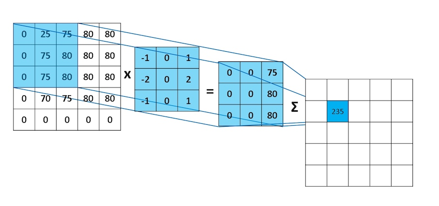
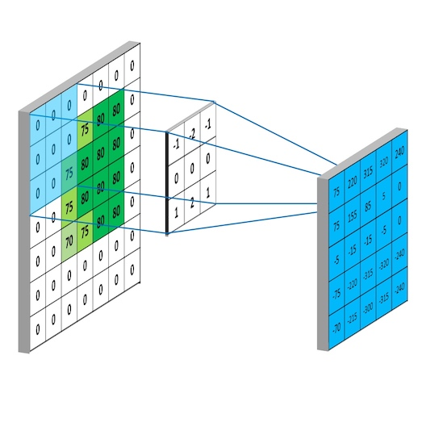
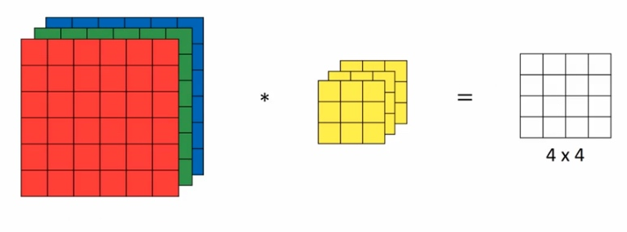
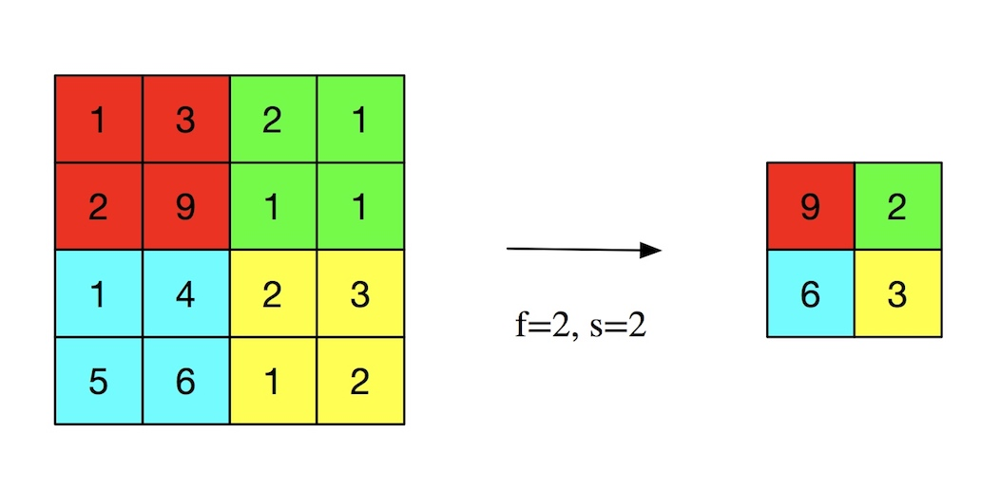

## 1. CNN特点

假设一批图片样本，图片尺寸都是100 × 100（单通道）。使用神经网络来进行训练，假设第一个隐藏层有2500个神经单元，则参数个数一共为 10000 × 2500 = 2500W

存在的问题：

1. 参数数据量太多，需要大量的计算资源
2. 图片是一个二维结构，相邻像素之间的关联较强，距离远的像素之间关联较弱，因此不必要一次性把所有像素在一起计算

CNN可以很好地解决这两个问题，其基本特点是：

- 权值共享
- 局部连接

## 2. 卷积

卷积是一种数学运算，定义可以参考[wiki](https://zh.wikipedia.org/wiki/%E5%8D%B7%E7%A7%AF)。在CNN中，主要关注离散卷积。关于离散卷积的例子，可以参考 [如何通俗易懂地解释卷积？- 马同学的回答](https://www.zhihu.com/question/22298352/answer/228543288)。CNN中的卷积操作和数学上的定义类似，但并不完全一致（相乘的顺序不同）。

卷积核即filter，用来对图像进行特征提取。计算规则如图所示：

> 图片来源：https://mlnotebook.github.io/post/CNN1/

假设图片尺寸为 $n_H \times n_W$，filter尺寸为 $f$，则卷积操作后的尺寸为 $(n_H-f+1) \times (n_W-f+1)$

## 3. Padding

上面的操作存在的不足：

1. 每次卷积操作都会使图像缩小
2. 角落和边缘区域的像素点使用的很少，即丢失了图像边缘位置的信息

为了解决这两个问题，在卷积操作之前，先对图像周围进行填充，通常为zero-padding，即填充0。

> 图片来源：https://mlnotebook.github.io/post/CNN1/

常用的填充方式为：

- Valid：不填充 $p=0$
- Same：输出尺寸和输入尺寸一致 $p=\frac{f-1}{2}$

> filter尺寸通常为奇数：方便same padding

## 4. Stride

filter每次移动多个像素。此时输出尺寸为：

$$ \lfloor \frac{n_H+2p-f}{s}+1 \rfloor \times \lfloor \frac{n_W+2p-f}{s}+1 \rfloor $$

## 5. Channel

对于RGB图像，有三个色彩通道，此时filter不再是二维，而是一个三维的结构。

> 图片来源：https://mlnotebook.github.io/post/CNN1/

- 输入尺寸 $n_H \times n_W \times n_C$
- filter尺寸 $f \times f \times n_C$
- 输出尺寸 $\lfloor \frac{n_H+2p-f}{s}+1 \rfloor \times \lfloor \frac{n_W+2p-f}{s}+1 \rfloor$

假设filter的个数为 $n_C^{'}$，则最后输出的尺寸为 $\lfloor \frac{n_H+2p-f}{s}+1 \rfloor \times \lfloor \frac{n_W+2p-f}{s}+1 \rfloor \times n_C^{'}$

## 6. 卷积层的符号表示

- filter size: $f^{[l]}$
- padding: $p^{[l]}$
- stride: $s^{[l]}$
- number of filters: $n_C^{[l]}$
- input: $n_H^{[l-1]} \times n_W^{[l-1]} \times n_C^{[l-1]}$
- output: $n_H^{[l]} \times n_W^{[l]} \times n_C^{[l]}$，其中 $n_H^{[l]}=\lfloor \frac{n_H^{[l-1]}+2p^{[l]}-f^{[l]}}{s^{[l]}}+1 \rfloor$, $n_W^{[l]}=\lfloor \frac{n_W^{[l-1]}+2p^{[l]}-f^{[l]}}{s^{[l]}}+1 \rfloor$
- each filter: $f^{[l]} \times f^{[l]} \times n_C^{[l-1]}$
- activations: $a^{[l]}\rightarrow n_H^{[l]} \times n_W^{[l]} \times n_C^{[l]}$, $A^{[l]}\rightarrow m \times n_H^{[l]} \times n_W^{[l]} \times n_C^{[l]}$
- weights: $f^{[l]} \times f^{[l]} \times n_C^{[l-1]} \times n_C^{[l]}$
- bias: $\in (1, 1, 1, n_C^{[l]})$

## 7. Pooling

- 提高计算速度
- 提高所提取的特征的有效性

参数：尺寸 $f$，步长 $s$

pooling方法有：

- max pooling
- average pooling

常用的是max pooling：

## 8. CNN一般结构

- 卷积层（CONV）
- 池化层（POOL）
- 全连接层（FC）
