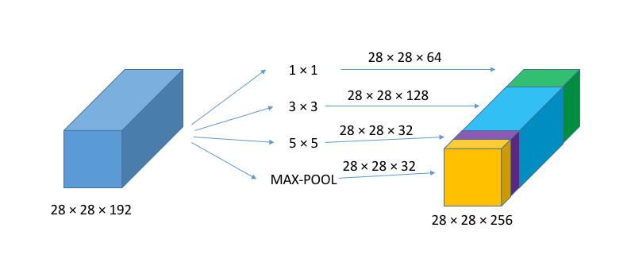
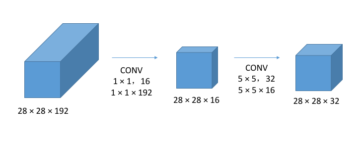
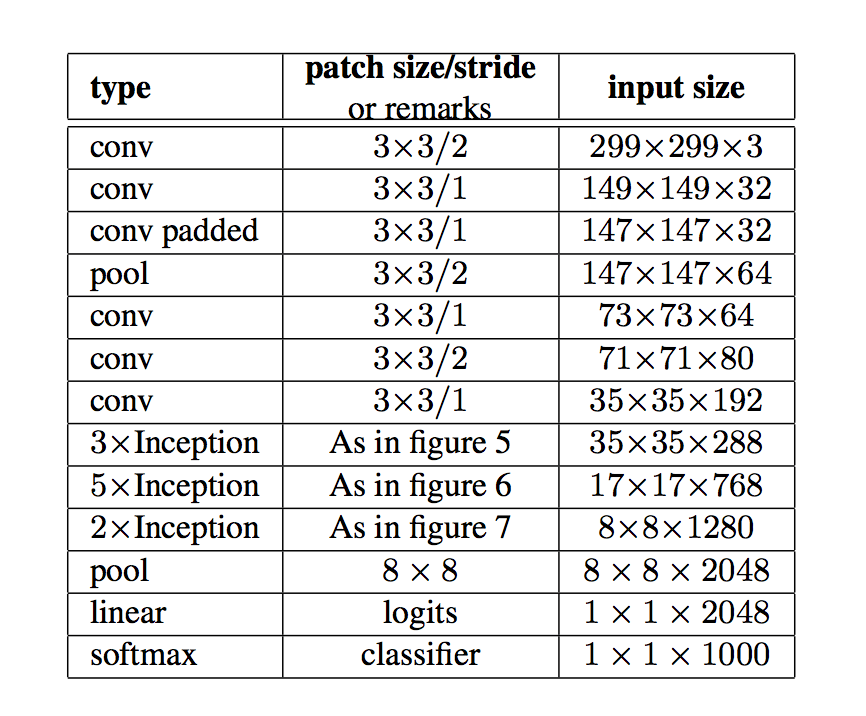

## 1. 论文

- V1: [Going Deeper with Convolutions](https://arxiv.org/abs/1409.4842)
- V2: [Batch Normalization: Accelerating Deep Network Training by Reducing Internal Covariate Shift](https://arxiv.org/abs/1502.03167)
- V3: [Rethinking the Inception Architecture for Computer Vision](https://arxiv.org/abs/1512.00567)
- V4: [Inception-v4, Inception-ResNet and the Impact of Residual Connections on Learning](https://arxiv.org/abs/1602.07261)

## 2. V1

Inception V1主要就是将不同的CONV和POOL堆叠在一起，一方面增加了网络的宽度，一方面提高了尺寸的自适应性，即不需要人为确定应该使用什么尺寸的filter，而是让网络来自己学习。

如上图(a)所示，左边就是一个简单的Inception module，对输入层分别使用 $1\times1,3\times3,5\times5$ 的卷积以及 $3\times3$ 的池化，然后将这些结果堆叠起来作为下一层。具体操作如下图所示：

对于其中 $5\times5$ 的卷积，一共需要的乘法计算次数为 $(5\times5\times192)\times(28\times28\times32)=120,422,400$，这个计算成本是巨大的。因此往往会先通过 $1\times1$ 的卷积缩减维度，从而降低计算成本，如第一幅图中的(b)所示。降维操作如下图所示：

此时计算量为 $(1\times1\times192)\times(28\times28\times16)+(5\times5\times16)\times(28\times28\times32)=12,443,648$，是原来的差不多十分之一。

## 3. V2

V2相比V1主要有以下改进：

1. 使用了 Batch Normalization
2. 使用两个 $3\times3$ 的卷积核来代替一个 $5\times5$ 的，一方面减少了参数，另一方面增加了更多的非线性变换（网络深度）

此时 Inception module 如下图所示：

## 4. V3

V3使用 $1\times n$ 和 $n\times1$ 的卷积来代替一个 $n\times n$ 的卷积。

在Inception V3中，有三种Inception module，如下图示：

最终的网络结构如下表所示：

## 5. V4

Inception V4是Inception与ResNet相结合。

