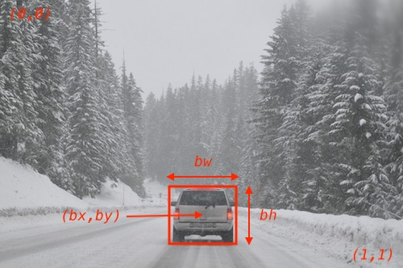
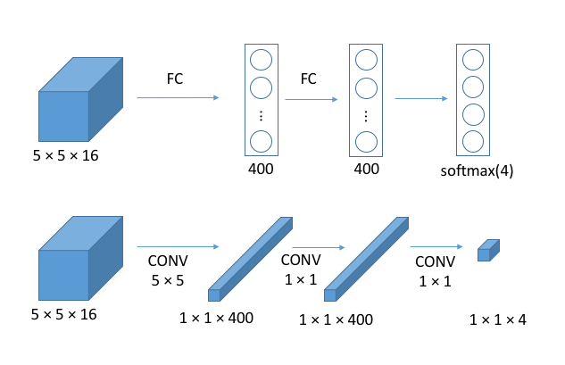
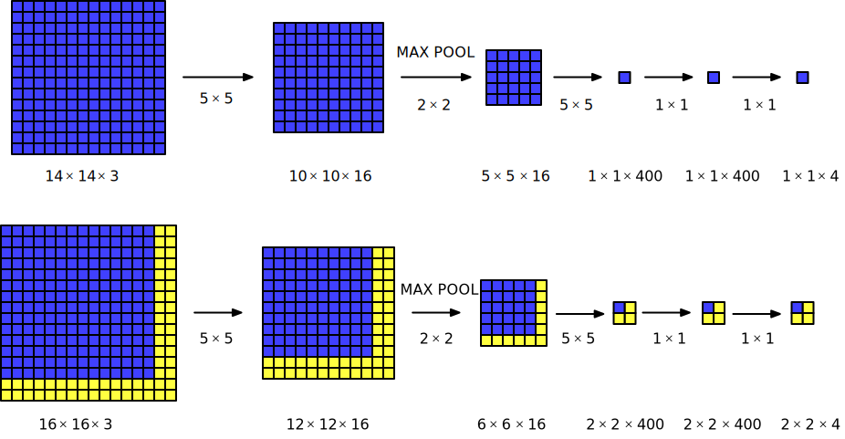
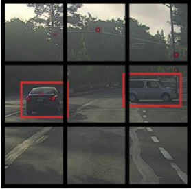
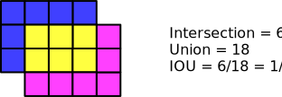
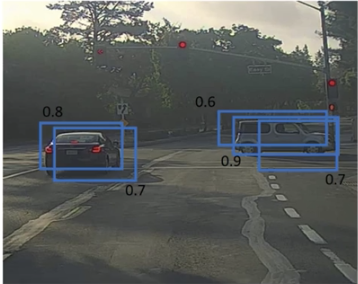
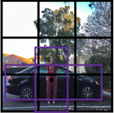
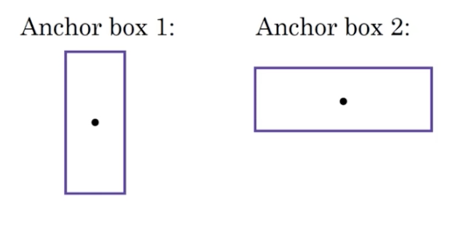

## 1. 目标定位

- 图片左上角为$(0,0)$，图片右下角为$(1,1)$
- 目标中心点为$(b_x,b_y)$，宽度为$b_w$，高度为$b_h$

假设要识别的目标有三类：

- 行人
- 汽车
- 摩托车

则：

$$
y=\begin{bmatrix}
P_c \\
b_x \\
b_y \\
b_h \\
b_w \\
c_1 \\
c_2 \\
c_3
\end{bmatrix}
$$

其中 $P_c$ 表示识别为某一类的概率，$b_x,b_y,b_h,b_w$ 定位该目标，$c_1,c_2,c_3$ 是one-hot形式，表示具体的类别。例如上图中的汽车表示为：

$$
y=\begin{bmatrix}
1 \\
0.5 \\
0.8 \\
0.2 \\
0.2 \\
0 \\
1 \\
0
\end{bmatrix}
$$

如果图片中没有检测到需要识别的对象，则表示为：

$$
y=\begin{bmatrix}
0 \\
? \\
? \\
? \\
? \\
? \\
? \\
?
\end{bmatrix}
$$

损失函数可以表示为：

$$
\mathcal{L}(\hat{y},y)=\begin{cases}
\sum(\hat{y}_i-y_i)^2 & y_1=1 \\
(\hat{y}_1-y_1)^2 & y_1=0
\end{cases}
$$

这里使用平方差简化了流程，实际上，可以针对 $P_c$ 使用逻辑回归，针对 $b_x,b_y,b_h,b_w$ 使用平方差，对 $c_1,c_2,c_3$ 使用softmax。

## 2. 滑动窗口

检测图片中的对象，可以通过滑动窗口的方式。即定义一个固定大小的窗口，在图片区域上滑动。对每个区域分别进行检测。

为了在卷积网络中使用滑动窗口，首先要将全连接层转换为卷积层。如图所示：

在应用滑动窗口的过程中，不是每个窗口单独去计算的，而是一次性计算多个窗口，这样许多计算都是可以共享的，如下图所示：

上半部分是针对一个窗口的计算，下面是同时计算了四个窗口，每个窗口大小为 $14\times14$。因此只需要把图片整体计算一遍就可以了。

该部分内容可以参考论文[OverFeat: Integrated Recognition, Localization and Detection using Convolutional Networks](https://arxiv.org/abs/1312.6229)。

滑动窗口的卷积实现，虽然计算效率高，但是也存在着显而易见的缺点，即由于窗口大小和滑动步长的原因，窗口不一定正好匹配需要检测的对象，因此不能够输出精准的边界框。

## 3. YOLO

论文参考[You Only Look Once: Unified, Real-Time Object Detection](https://arxiv.org/abs/1506.02640)。

如图所示，将图片分成一个个网格，对每个格子应用目标定位算法。针对每一个格子，其标签形式都是：

$$
y=\begin{bmatrix}
P_c \\
b_x \\
b_y \\
b_h \\
b_w \\
c_1 \\
c_2 \\
c_3
\end{bmatrix}
$$

在上图中，一共有两个目标，选取这两个目标的中心点，将这两个目标分别分给包含其中心点的格子。然后针对每一个格子，将其坐标归一化到 $(0,1)$ 范围内。因此 $b_x$ 和 $b_y$ 都在 $(0,1)$ 范围内，但是 $b_h$ 和 $b_w$ 可以大于1。因为一个目标可能横跨多个网格，但是其中心点只会落在一个格子内。

## 4. IOU

IOU（Intersection Over Union）即交并比，即计算两个边界框的交集和并集之比，如图所示：

对检测出的边界框和实际的边界框求IOU，一般认为大于等于0.5的时候，检测是正确的。

## 5. Non-Max Suppression

缩写NMS，即非极大值抑制。在进行目标检测的时候，可能会对同一个目标检测多次，如图所示：

该算法用于保证对同一只对象只检测一次。算法流程是：

- 设定 $threshold$，舍弃所有 $P_c\leq threshold$
- 针对剩下的所有边界框，选择 $P_c$ 最大的，作为一个预测输出；并且把所有与这个边界框 $IOU\geq0.5$ 的边界框都舍弃
- 重复第二步的过程

## 6. Anchor Box

在上面介绍的算法中，一个网格只能检测出一个对象，但是有些情况下，可能多个对象都会落到同一个网格中，如图所示：

预先定义一些 anchor box 的形状，例如：

然后

$$
y=\begin{bmatrix}
P_c \\
b_x \\
b_y \\
b_h \\
b_w \\
c_1 \\
c_2 \\
c_3 \\
P_c \\
b_x \\
b_y \\
b_h \\
b_w \\
c_1 \\
c_2 \\
c_3 \\
\end{bmatrix}
$$

其中上半部分表示 anchor box1，下半部分表示 anchor box2。因此图中的格子可以表示为：

$$
y=\begin{bmatrix}
1 \\
b_x \\
b_y \\
b_h \\
b_w \\
1 \\
0 \\
0 \\
1 \\
b_x \\
b_y \\
b_h \\
b_w \\
0 \\
1 \\
0 \\
\end{bmatrix}
$$
