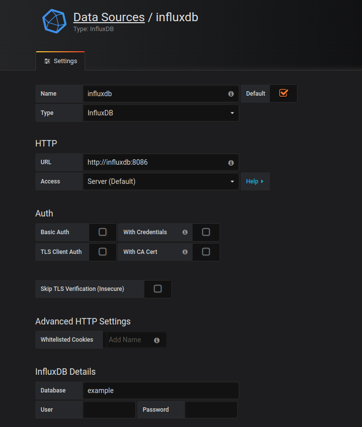
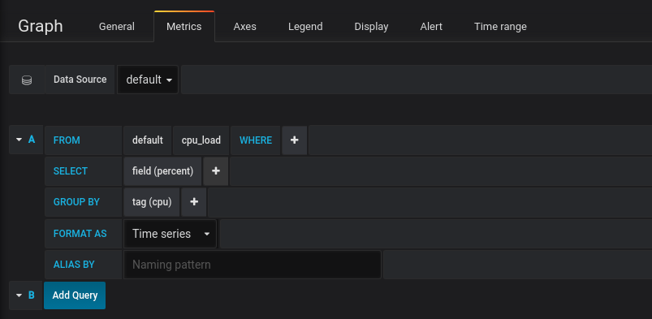
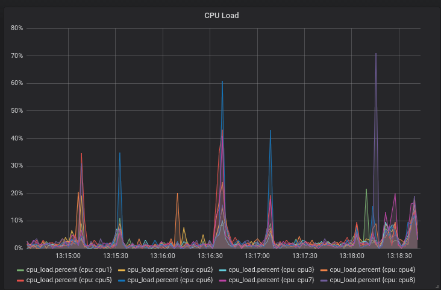

InfluxDB是一个时序型数据库，主要用于存储时序型相关的数据，例如实时的温度、湿度，计算机的CPU使用率、内存使用率等。时序型数据的一些主要特点有：

- 写入平稳，持续写入
- 写入多，读取少
- 写入的数据几乎不会更新
- 数据量大，数据具有时效性
- 需要多精度的查询
- ……

InfluxDB中的基本概念是：

- measurement，对应关系数据库中的表
- tags，对应关系数据库中的索引列
- fields，对应关系数据库中的普通列

其数据协议格式为：

```
<measurement>[,<tag-key>=<tag-value>...] <field-key>=<field-value>[,<field2-key>=<field2-value>...] [unix-nano-timestamp]
```

例如下面的都是有效的数据：

```
cpu,host=serverA,region=us_west value=0.64

payment,device=mobile,product=Notepad,method=credit billed=33,licenses=3i 1434067467100293230

stock,symbol=AAPL bid=127.46,ask=127.48

temperature,machine=unit42,type=assembly external=25,internal=37 1434067467000000000
```

InfluxDB结合Grafana，可以进行数据的监控。下面是使用docker做的一个简单例子。

首先启动InfluxDB和Grafana：

```sh
$ docker run -d -p 8086:8086 -v "$PWD/influxdb":/var/lib/influxdb --name influxdb influxdb
$ docker run -d -p 3000:3000 --name grafana --link influxdb grafana/grafana
```

然后要向InfluxDB中写入数据，这里使用psutil来统计CPU的使用情况：


```py
import psutil
from influxdb import InfluxDBClient


def gen_point(i, percent):
    return {
        'measurement': 'cpu_load',
        'tags': {
            'cpu': 'cpu%d' % i
        },
        'fields': {
            'percent': percent
        }
    }


def main(host='localhost', port=8086):
    database = 'example'
    client = InfluxDBClient(host, port, database=database)
    client.create_database(database)

    while True:
        cpu_percent = psutil.cpu_percent(interval=2, percpu=True)
        data = [gen_point(idx + 1, percent) for idx, percent in enumerate(cpu_percent)]
        client.write_points(data)

if __name__ == '__main__':
    main()
```

这个时候就可以查看到数据了：

```sh
$ influxdb
> use example
> select * from cpu_load limit 5
```

接下来浏览器打开 localhost:3000，登录Grafana，首先配置数据源：



然后新建dashboard，配置图表：



然后就可以看到统计图了：


