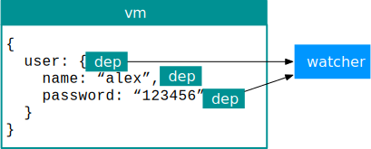
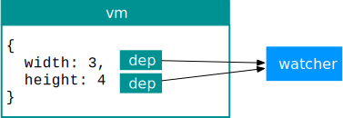

## 一、基本实现

关于Vue的响应式原理，可以参考 [Reactivity in Depth](https://vuejs.org/v2/guide/reactivity.html)。

从实现细节上来说，主要涉及到三个类：`Observer`，`Dep` 和 `Watcher`。它们的关系是：`Observer` 观察到数据的变化，并调用 `Dep` 的相关方法，通知到 `Watcher`，然后 `Watcher` 执行相应的回调（更新视图等）。

下面是一个最简单的实现：

```js
/**
 * Dep
 */

class Dep {
  constructor() {
    this.subs = []
  }

  addSub(sub) {
    this.subs.push(sub)
  }

  depend() {
    if (Dep.target) {
      Dep.target.addDep(this)
    }
  }

  notify() {
    this.subs.forEach(sub => sub.update())
  }
}

Dep.target = null
const targetStack = []

function pushTarget(_target) {
  if (Dep.target) {
    targetStack.push(Dep.target)
  }
  Dep.target = _target
}

function popTarget() {
  Dep.target = targetStack.pop()
}

/**
 * Watcher
 */

class Watcher {
  constructor(vm, exp, cb) {
    this.vm = vm
    this.cb = cb
    this.deps = []
    this.getter = obj => obj[exp]
    this.value = this.get()
  }

  get() {
    pushTarget(this)
    const vm = this.vm
    let value = this.getter.call(vm, vm)
    popTarget()
    return value
  }

  addDep(dep) {
    if (this.deps.indexOf(dep) < 0) {
      this.deps.push(dep)
      dep.addSub(this)
    }
  }

  update() {
    const value = this.get()
    if (value !== this.value) {
      const oldValue = this.value
      this.value = value
      this.cb.call(this.vm, value, oldValue)
    }
  }
}

/**
 * Observer
 */

class Observer {
  constructor(value) {
    this.value = value
    this.walk(value)
  }

  walk(obj) {
    Object.keys(obj).forEach(key => {
      defineReactive(obj, key)
    })
  }
}

function observe(value) {
  return new Observer(value)
}

function defineReactive(obj, key) {
  const dep = new Dep()
  let val = obj[key]

  Object.defineProperty(obj, key, {
    enumerable: true,
    configurable: true,
    get: function reactiveGetter() {
      const value = val
      if (Dep.target) {
        dep.depend()
      }
      return value
    },
    set: function reactiveSetter(newVal) {
      val = newVal
      dep.notify()
    }
  })
}

function createVM(data) {
  const vm = { $data: data }

  // 代理$data的数据，模拟vue中的实现
  Object.keys(data).forEach(key => {
    Object.defineProperty(vm, key, {
      get() { return this.$data[key] },
      set(val) { this.$data[key] = val }
    })
  })

  // 观察$data
  observe(vm.$data)

  return vm
}

// main
const vm = createVM({
  message: 'hello',
  name: 'alex'
})

// 当message发生变化时，打印出相应的信息
watcher = new Watcher(vm, 'message', (newVal, oldVal) => {
  console.log(`value changed: new value is '${newVal}', old value is '${oldVal}'`)
})

// 触发变化，该操作会输出：value changed: new value is 'test', old value is 'hello'
vm.message = 'test'
```

上面的代码是一个非常简单的实现，支持对非嵌套普通对象的数据响应。

在 `observe(value)` 的时候，会遍历 `value` 的属性，对每个属性设置代理操作，即 `defineReactive`。

在 `defineReactive` 操作中，会对每个属性生成一个 `Dep` 对象，然后在 `reactiveGetter` 中，会通过 `dep.depend()` 收集依赖，在 `reactiveSetter` 中，通过 `dep.notify()` 通知所有依赖此 Dep 对象的 Watcher。

Watcher 是对对象某个属性的观测，Watcher 在创建的时候，会通过 `this.value = this.get()` 来计算表达式的值，`this.get()` 逻辑如下：

```js
get() {
  // 此时Dep.target是此watcher
  pushTarget(this)

  // this.getter.call(vm, vm)调用的是obj[exp]
  // 在上面例子中也就是调用了vm.message，也就是调用message的reactiveGetter方法
  // 由于此时Dep.target是当前watcher，因此会调用dep.depend()
  // 从而会调用watcher.addDep方法，将message的dep添加到改watcher的依赖中
  const vm = this.vm
  let value = this.getter.call(vm, vm)

  popTarget()
  return value
}
```

当调用 `vm.message = 'test'` 的时候，`messaeg` 的 `reactiveSetter` 方法触发，从而调用 `dep.notify()`，由于 `watcher` 依赖中有该 Dep，因此会执行 `watcher.update()`，从而回调函数会被调用。

用图示例如下：


## 二、功能增强

### 1. 支持嵌套对象

上面的例子只支持最简单的普通对象，并且不支持对象嵌套，例如下面的代码就不会生效：

```js
const vm = createVM({
  user: {
    name: 'alex',
    password: '123456'
  }
})

watcher = new Watcher(vm, 'user.password', (newVal, oldVal) => {
  console.log(`value changed: new value is '${newVal}', old value is '${oldVal}'`)
})

vm.user.password = '654321'
```

为了支持嵌套的对象，需要做如下改造：

首先如果属性值是一个对象，则应该递归去 observe：

```js
function observe(value) {
  const isObject = obj => obj !== null && typeof obj === 'object'
  // 如果要观察的值不是对象，则直接返回
  if (!isObject(value)) {
    return
  }
  return new Observer(value)
}

function defineReactive(obj, key) {
  const dep = new Dep()
  let val = obj[key]

  // 如果val不是Object，直接返回
  // 否则会递归对嵌套对象的属性进行观察
  observe(val)

  Object.defineProperty(obj, key, {
    // ...
  })
}
```

然后修改 Watcher，使其支持例如 `a.b.c` 这样的属性路径：

```js
function parsePath(path) {
  const segments = path.split('.')
  return function(obj) {
    for (let i = 0; i < segments.length; i++) {
      if (!obj) {
        return
      }
      obj = obj[segments[i]]
    }
    return obj
  }
}

class Watcher {
  constructor(vm, exp, cb) {
    this.vm = vm
    this.cb = cb
    this.deps = []
    this.getter = parsePath(exp)
    this.value = this.get()
  }

  // ...
}
```

此时：

```js
const vm = createVM({
  user: {
    name: 'alex',
    password: '123456'
  }
})

watcher = new Watcher(vm, 'user.password', (newVal, oldVal) => {
  console.log(`value changed: new value is '${newVal}', old value is '${oldVal}'`)
})

vm.user.password = '654321'
// value changed: new value is '654321', old value is '123456'

vm.user = { password: 'admin' }
// value changed: new value is 'admin', old value is '654321'
```

此时示意图如下：



### 2. Watcher支持函数

目前 `Watcher` 的 `exp` 参数只支持字符串，但是在有些情况下，我们希望能够传入一个函数，以如下方式来使用：

```js
const vm = createVM({
  width: 3,
  height: 4
})

watcher = new Watcher(vm, function() {
  return this.width * this.height
}, (newVal, oldVal) => {
  console.log(`value changed: new value is '${newVal}', old value is '${oldVal}'`)
})
```

此时需要调整 `Watcher`：

```js
class Watcher {
  constructor(vm, expOrFn, cb) {
    this.vm = vm
    this.cb = cb
    this.deps = []
    if (typeof expOrFn === 'function') {
      this.getter = expOrFn
    } else {
      this.getter = parsePath(expOrFn)
    }
    this.value = this.get()
  }

  // ...
}
```

此时：

```js
vm.width = 4
// value changed: new value is '16', old value is '12'

vm.height = 5
// value changed: new value is '20', old value is '16'
```

示意图如下：



### 3. 支持watch数组

以上只是支持了对 object 的观察，如果是数组的话，需要对数组每一项做观察，改造如下：

```js
class Watcher {
  // ...

  update() {
    const value = this.get()
    // 如果调用了数组的push等方法，则value === this.value依然成立，但是数组的元素已经发生了变化
    if (value !== this.value || Array.isArray(this.value)) {
      const oldValue = this.value
      this.value = value
      this.cb.call(this.vm, value, oldValue)
    }
  }
}


// 对数组的方法做拦截，当调用这些方法的时候，会触发watcher
const arrayMethods = Object.create(Array.prototype)
const methodsToPatch = [
  'push',
  'pop',
  'shift',
  'unshift',
  'splice',
  'sort',
  'reverse'
]

methodsToPatch.forEach(method => {
  const original = arrayMethods[method]
  Object.defineProperty(arrayMethods, method, {
    value: function(...args) {
      const result = original.apply(this, args)
      const ob = this.__ob__
      let inserted
      switch (method) {
        case 'push':
        case 'unshift':
          inserted = args
          break
        case 'splice':
          inserted = args.slice(2)
          break
      }
      if (inserted) {
        ob.observeArray(inserted)
      }
      ob.dep.notify()
      return result
    }
  })
})

class Observer {
  constructor(value) {
    this.value = value
    this.dep = new Dep()
    Object.defineProperty(value, '__ob__', {
      value: this,
      enumerable: false
    })
    if (Array.isArray(value)) {
      // 对数组遍历watch
      value.__proto__ = arrayMethods
      this.observeArray(value)
    } else {
      this.walk(value)
    }
  }

  walk(obj) {
    Object.keys(obj).forEach(key => {
      defineReactive(obj, key)
    })
  }

  observeArray(items) {
    items.forEach(item => observe(item))
  }
}

function observe(value) {
  const isObject = obj => obj !== null && typeof obj === 'object'
  if (!isObject(value)) {
    return
  }
  let ob
  if (Object.hasOwnProperty(value, '__ob__') && value.__ob__ instanceof Observer) {
    // 避免重复watch
    ob = value.__ob__
  } else {
    ob = new Observer(value)
  }
  return ob
}

function defineReactive(obj, key) {
  const dep = new Dep()
  let val = obj[key]

  let childOb = observe(val)

  Object.defineProperty(obj, key, {
    enumerable: true,
    configurable: true,
    get: function reactiveGetter() {
      const value = val
      if (Dep.target) {
        dep.depend()
        if (childOb) {
          childOb.dep.depend()
        }
      }
      return value
    },
    set: function reactiveSetter(newVal) {
      val = newVal
      childOb = observe(newVal)
      dep.notify()
    }
  })
}
```

此时：

```js
const vm = createVM({
  items: [1, 2]
})

watcher = new Watcher(vm, 'items', (newVal, oldVal) => {
  console.log(`value changed: new value is '${newVal}'`)
})

vm.items.push(3)
// value changed: new value is '1,2,3'

vm.items.unshift(0)
// value changed: new value is '0,1,2,3'
```
