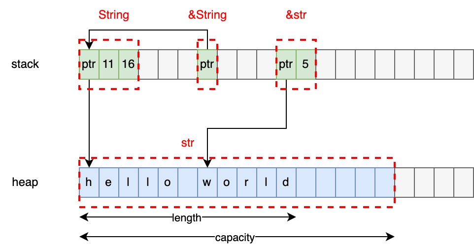

## 1. String、&String、str、&str

从本质上来说，Rust中只有一种字符串，就是`str`，而`String`只不过是基于`str`的一个结构体。具体关系参考下图：



- `str`可以认为是分配在堆上的数据，本质上是是一个`Vec<u8>`
- `&str`是对`str`的一个引用，是字符串切片。本质上是一个胖指针，除了引用地址外，额外多了一个属性表示字符串长度
- `String`是一个结构体，包含三部分：指针、长度、容量
- `&String`是对`String`的一个引用，是一个普通指针

此外，值得了解的是：

- 字符串字面量的类型为`&str`，且具有`'static`的生命周期，即`&'static str`
- 通常我们使用的是`String`、`&String`或`&str`，一般不会直接使用`str`

## 2. 转换

`String`和`&str`之间的相互转换，参考如下示例：

```rust
fn main() {
    let s1 = "hello world";  // &str
    println!("{}", s1.len());

    let s2 = s1.to_string(); // &str -> String
    println!("{}", s2.len());
    println!("{}", s2.capacity());

    let s3 = String::from("hello world"); // String
    println!("{}", s2.len());
    println!("{}", s2.capacity());

    let s4 = s3.as_str(); // String -> &str
    println!("{}", s4.len());

    let s5 = &s3[6..];    // String -> &str
    println!("{}", s5);
}
```

## 参考

- [String vs &str in Rust](https://blog.thoughtram.io/string-vs-str-in-rust/)
