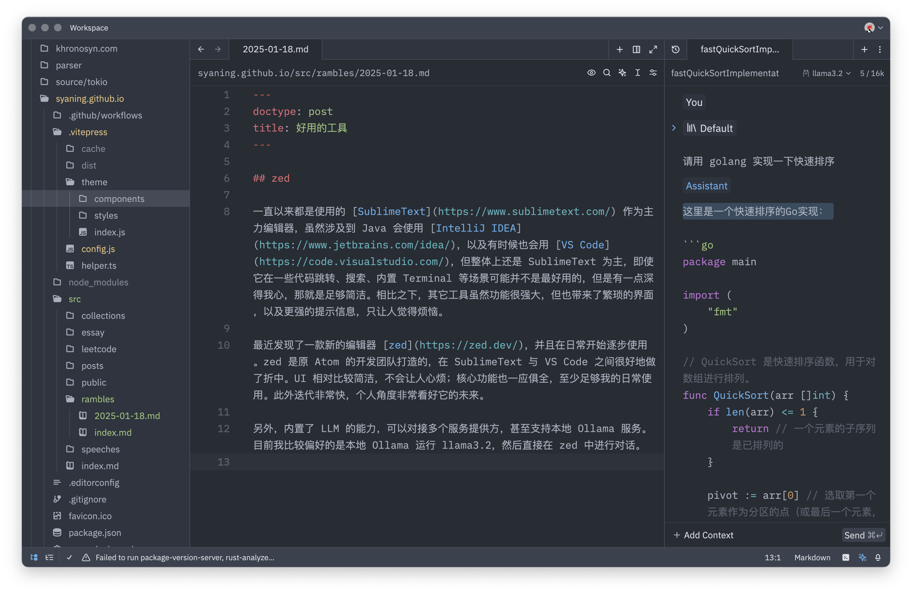
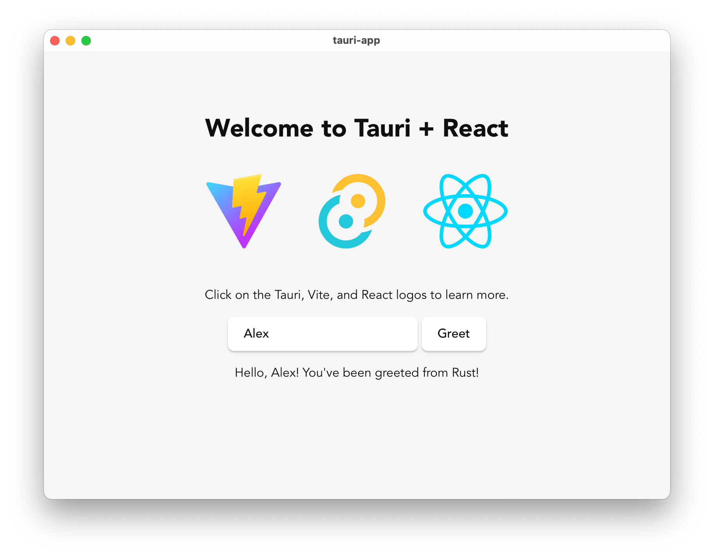

## zed

一直以来都是使用的 [SublimeText](https://www.sublimetext.com/) 作为主力编辑器，虽然涉及到 Java 会使用 [IntelliJ IDEA](https://www.jetbrains.com/idea/)，以及有时候也会用 [VS Code](https://code.visualstudio.com/)，但整体上还是 SublimeText 为主，即使它在一些代码跳转、搜索、内置 Terminal 等场景可能并不是最好用的，但是有一点深得我心，那就是足够简洁。相比之下，其它工具虽然功能很强大，但也带来了繁琐的界面，以及更强的提示信息，只让人觉得烦恼。

最近发现了一款新的编辑器 [zed](https://zed.dev/)，并且在日常开始逐步使用。zed 是原 Atom 的开发团队打造的，在 SublimeText 与 VS Code 之间很好地做了折中。UI 相对比较简洁，不会让人心烦；核心功能也一应俱全，至少足够我的日常使用。此外迭代非常快，个人角度非常看好它的未来。

另外，内置了 LLM 的能力，可以对接多个服务提供方，甚至支持本地 Ollama 服务。目前我比较偏好的是本地 Ollama 运行 llama3.2，然后直接在 zed 中进行对话。

## Tauri

[Tauri](https://v2.tauri.app/) 是基于 Rust 开发的跨平台应用框架，相比于 [Electron](https://www.electronjs.org/) 来说，体积和性能都会更有优势一些，用来做 GUI 应用还是挺不错的。更多资料可以参考官网和 [aweome-tauri](https://github.com/tauri-apps/awesome-tauri)。

## Iconify

[Iconify](https://iconify.design/) 是一个开源图标集，有着丰富的图标，且易于使用。自己博客用到的一些图标也切到了 Iconify.
