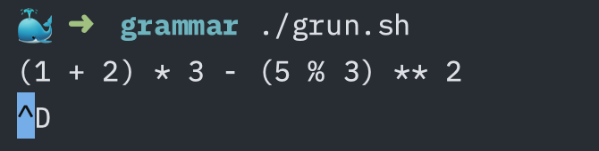
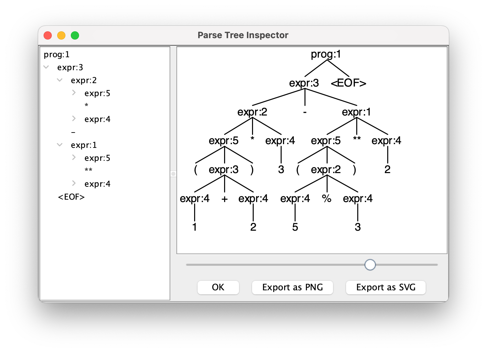

## 1. ANTLR 介绍

[ANTLR](https://www.antlr.org/) (ANother Tool for Language Recognition) 是一款强大的语法分析器生成工具。它广泛应用于构建语言识别工具，如编译器、解释器、解析器等。ANTLR 通过定义语法规则自动生成词法分析器和语法分析器，极大地简化了开发过程。

通常来说，如果我们需要实现一个编程语言或者 DSL（Domain Specific Language）的编译器或解释器，需要：

1. 定义语法：使用 ANTLR 的话，我们可以通过 ANTLR 元语言（ANTLR's meta-language）来定义语法。
2. 词法分析（Lexical Analysis）或词法符号化（Tokenizing）：将源代码的字符序列分割为有意义的符号单元（token），例如关键字、标识符、运算符、分隔符等。这一步的程序我们称之为 Lexer 或 Tokenizer。
3. 语法分析（Syntax Analysis）：将 tokens 生成表示程序结构的抽象语法树（Abstract Syntax Tree, AST），或者叫做语法分析树（Parse Tree）或者句法树（Syntax Tree）。这一步的程序我们称之为 Parser。
4. 对语法树遍历执行。


## 2. 实现一个计算器

::: tip
示例代码参考 https://github.com/syaning/examples/tree/master/antlr/calculator
:::

### 2.1 需求

实现一个计算器程序：

* 支持加减乘除、取模、幂运算
* 暂时只考虑非负整数操作，不考虑浮点数和负数

### 2.2 安装

参考 [Getting Started with ANTLR v4](https://github.com/antlr/antlr4/blob/master/doc/getting-started.md) 下载：

```shell
curl -O https://www.antlr.org/download/antlr-4.13.2-complete.jar
```

### 2.3 语法定义

::: code-group
```txt [CalculatorLexer.g4]
lexer grammar CalculatorLexer;

ADD : '+';
SUB : '-';
MUL : '*';
DIV : '/';
MOD : '%';
EXP : '**';

LEFT_PAREN  : '(';
RIGHT_PAREN : ')';
NUMBER      : [1-9] [0-9]*;
WHITESPACE  : [ \t\r\n\u000C]+ -> skip;
```

```txt [CalculatorParser.g4]
parser grammar CalculatorParser;

options {
    tokenVocab = CalculatorLexer;
}

prog: expr EOF;

expr: expr EXP expr
    | expr (MUL|DIV|MOD) expr
    | expr (ADD|SUB) expr
    | NUMBER
    | LEFT_PAREN expr RIGHT_PAREN
    ;
```
:::

### 2.4 调试

::: code-group
```shell [grun.sh]
#!/bin/bash

alias antlr4-parse='java -Xmx500M -cp "./antlr-4.13.2-complete.jar:$CLASSPATH" org.antlr.v4.gui.TestRig'
antlr4-parse *.g4 prog -gui
```
:::

执行 `./grun.sh`，输入表达式，例如 `(1 + 2) * 3 - (5 % 3) ** 2`，然后按 `Ctrl + D`：



可以看到解析的语法树如下：



除了 `-gui` 选项外，还可以使用 `-tree`（以 LISP 格式输出语法分析树）或者 `-tokens`（输出词法符号流）选项来进行调试。

### 2.5 代码生成

该例子中，我们生成 Go 的代码，如果需要生成其它语言的代码，可以参考官方文档。

::: code-group
```shell [generate.sh]
#!/bin/bash

alias antlr4='java -Xmx500M -cp "./antlr-4.13.2-complete.jar:$CLASSPATH" org.antlr.v4.Tool'
antlr4 -Dlanguage=Go -visitor -package parsing *.g4 -o ../parsing
```

```go [generate.go]
package grammar

//go:generate ./generate.sh
```
:::

执行 `go generate ./...`，可以生成解析器代码，生成的代码在 `../parser` 目录下。

* `calculator_lexer.go`: 词法分析器
* `calculator_parser.go`: 语法分析器
* `*.tokens`: 词法符号表，定义了标记及其对应的整数标识符，帮助理解和调试标记识别过程
* `*.interp`: 包含了解析器和词法分析器的内部状态信息，用于优化解析性能和支持高级功能
* `calculatorparser_listener.go`: 定义了监听器接口，允许你在解析过程中监听特定事件
* `calculatorparser_base_listener.go`: 监听器的默认实现
* `calculatorparser_visitor.go`: 定义了访问器接口，允许你遍历和处理抽象语法树
* `calculatorparser_base_visitor.go`: 访问器的默认实现

### 2.6 实现 Listener

语法解析的过程如下图所示：

1. 原始文本解析成 ChartStream
2. 经过 lexer 将 ChartStream 解析为 TokenStream
3. 经过 parser 将 TokenStream 解析为语法树，语法树包含两类节点：RuleNode（子树的根节点）和 TerminalNode（叶子结点）


对应的语法树如下所示，其中 `ProgContext` 和 `ExprContext` 都是 `calculator_parser.go` 中生成的代码。


语法树会按照深度优先的方式进行遍历，过程如下图所示：

* 每个 RuleNode 的访问都有 Enter 和 Exit 两个监听
* TerminalNode 的访问会有 VisitTerminal 监听


可以先实现一个简单的 Listener:

::: code-group
```go [calculator_listener.go]
package calc

import (
    "fmt"

    "github.com/antlr4-go/antlr/v4"

    "calculator/parsing"
)

type CalculatorListener struct {
    *parsing.BaseCalculatorParserListener
}

func NewCalculatorListener() *CalculatorListener {
    return &CalculatorListener{
        BaseCalculatorParserListener: &parsing.BaseCalculatorParserListener{},
    }
}

func (l *CalculatorListener) VisitTerminal(node antlr.TerminalNode) {
    fmt.Println("VisitTerminal", node.GetText())
}

func (l *CalculatorListener) EnterProg(ctx *parsing.ProgContext) {
    fmt.Println("EnterProg", ctx.GetText())
}

func (l *CalculatorListener) ExitProg(ctx *parsing.ProgContext) {
    fmt.Println("ExitProg", ctx.GetText())
}

func (l *CalculatorListener) EnterExpr(ctx *parsing.ExprContext) {
    fmt.Println("EnterExpr", ctx.GetText())
}

func (l *CalculatorListener) ExitExpr(ctx *parsing.ExprContext) {
    fmt.Println("ExitExpr", ctx.GetText())
}
```

```go [main.go]
package main

import (
    "calculator/calc"
    "calculator/parsing"

    "github.com/antlr4-go/antlr/v4"
)

func parseTree(prog string) antlr.ParseTree {
    input := antlr.NewInputStream(prog)
    lexer := parsing.NewCalculatorLexer(input)

    stream := antlr.NewCommonTokenStream(lexer, 0)
    parser := parsing.NewCalculatorParser(stream)

    return parser.Prog()
}

func main() {
    prog := `12 + 34`
    tree := parseTree(prog)

    listener := calc.NewCalculatorListener()
    antlr.ParseTreeWalkerDefault.Walk(listener, tree)
}
```
:::

可以看到输出的结果为：

```txt
EnterProg 12+34<EOF>
EnterExpr 12+34
EnterExpr 12
VisitTerminal 12
ExitExpr 12
VisitTerminal +
EnterExpr 34
VisitTerminal 34
ExitExpr 34
ExitExpr 12+34
VisitTerminal <EOF>
ExitProg 12+34<EOF>
```

然后我们可以按照如下的思路，实现一个能实际进行计算的 Listener：

* `VisitTerminal()` 的时候，如果是数值类型，则入栈（也可以在 `ExitExpr()` 的时候，判断如果子节点只有一个，则进行入栈）
* `ExitExpr()` 的时候，如果有三个子节点，且中间的节点为 TerminalNode，则从栈中取出两个元素，进行计算后将结果入栈
* `ExitProg()` 的时候，正常栈中只有最终的结果，直接返回即可

::: code-group
```go [calculator_listener.go]
package calc

import (
    "fmt"
    "math"
    "strconv"

    "github.com/antlr4-go/antlr/v4"

    "calculator/parsing"
)

type CalculatorListener struct {
    *parsing.BaseCalculatorParserListener
    nums []int64
}

func NewCalculatorListener() *CalculatorListener {
    return &CalculatorListener{
        BaseCalculatorParserListener: &parsing.BaseCalculatorParserListener{},
    }
}

func (l *CalculatorListener) pop() int64 {
    if len(l.nums) == 0 {
        panic("Invalid expression")
    }
    size := len(l.nums)
    val := l.nums[size-1]
    l.nums = l.nums[:size-1]
    return val
}

func (l *CalculatorListener) VisitTerminal(node antlr.TerminalNode) {
    if node.GetSymbol().GetTokenType() == parsing.CalculatorParserNUMBER {
        num, err := strconv.ParseInt(node.GetText(), 10, 64)
        if err == nil {
            l.nums = append(l.nums, num)
        }
    }
}

func (l *CalculatorListener) ExitProg(ctx *parsing.ProgContext) {
    if len(l.nums) != 1 {
        panic("Invalid expression")
    }
    fmt.Println(l.nums[0])
}

func (l *CalculatorListener) ExitExpr(ctx *parsing.ExprContext) {
    if ctx.GetChildCount() == 3 {
        if op, ok := ctx.GetChild(1).(antlr.TerminalNode); ok {
            right, left := l.pop(), l.pop()

            switch op.GetSymbol().GetTokenType() {
            case parsing.CalculatorParserADD:
                l.nums = append(l.nums, left+right)
            case parsing.CalculatorParserSUB:
                l.nums = append(l.nums, left-right)
            case parsing.CalculatorParserMUL:
                l.nums = append(l.nums, left*right)
            case parsing.CalculatorParserDIV:
                l.nums = append(l.nums, left/right)
            case parsing.CalculatorParserMOD:
                l.nums = append(l.nums, left%right)
            case parsing.CalculatorParserEXP:
                l.nums = append(l.nums, int64(math.Pow(float64(left), float64(right))))
            }
        }
    }
}
```
:::

### 2.7 分支标签

我们可以进一步优化，为 `expr` 的不同分支打上标签，来优化 Listener 的实现。

* 为 `expr` 的每个分支打上标签（即 `# xxx`)，并且为操作符号指定名称为 `op`
* 然后重新生成代码，会发现每个分支都有单独的 `Enter / Exit` 方法
* `ExitNumber()` 的时候数值入栈，`ExitExp() / ExitMulDivMod() / ExitAddSub()` 的时候进行相应的运算即可

::: code-group
```txt{9-13} [CalculatorParser.g4]
parser grammar CalculatorParser;

options {
    tokenVocab = CalculatorLexer;
}

prog: expr EOF;

expr: expr op=EXP expr            # Exp
    | expr op=(MUL|DIV|MOD) expr  # MulDivMod
    | expr op=(ADD|SUB) expr      # AddSub
    | NUMBER                      # Number
    | LEFT_PAREN expr RIGHT_PAREN # Parens
    ;
```

```go [calculator_listener.go]
package calc

import (
    "fmt"
    "math"
    "strconv"

    "calculator/parsing"
)

type CalculatorListener struct {
    *parsing.BaseCalculatorParserListener
    nums []int64
}

func NewCalculatorListener() *CalculatorListener {
    return &CalculatorListener{
        BaseCalculatorParserListener: &parsing.BaseCalculatorParserListener{},
    }
}

func (l *CalculatorListener) pop() int64 {
    if len(l.nums) == 0 {
        panic("Invalid expression")
    }
    size := len(l.nums)
    val := l.nums[size-1]
    l.nums = l.nums[:size-1]
    return val
}

func (l *CalculatorListener) ExitProg(ctx *parsing.ProgContext) {
    if len(l.nums) != 1 {
        panic("Invalid expression")
    }
    fmt.Println(l.nums[0])
}

func (l *CalculatorListener) ExitNumber(ctx *parsing.NumberContext) {
    num, err := strconv.ParseInt(ctx.GetText(), 10, 64)
    if err == nil {
        l.nums = append(l.nums, num)
    }
}

func (l *CalculatorListener) ExitExp(ctx *parsing.ExpContext) {
    right, left := l.pop(), l.pop()
    l.nums = append(l.nums, int64(math.Pow(float64(left), float64(right))))
}

func (l *CalculatorListener) ExitMulDivMod(ctx *parsing.MulDivModContext) {
    right, left := l.pop(), l.pop()
    switch ctx.GetOp().GetTokenType() {
    case parsing.CalculatorParserMUL:
        l.nums = append(l.nums, left*right)
    case parsing.CalculatorParserDIV:
        l.nums = append(l.nums, left/right)
    case parsing.CalculatorParserMOD:
        l.nums = append(l.nums, left%right)
    }
}

func (l *CalculatorListener) ExitAddSub(ctx *parsing.AddSubContext) {
    right, left := l.pop(), l.pop()
    switch ctx.GetOp().GetTokenType() {
    case parsing.CalculatorParserADD:
        l.nums = append(l.nums, left+right)
    case parsing.CalculatorParserSUB:
        l.nums = append(l.nums, left-right)
    }
}
```
:::

### 2.8 实现 visitor

使用 visitor 的方式区别于事件监听的方式，而是可以手动控制如何遍历子节点，以及访问特定类型节点时如何做。下面是一个完整的实现。

::: tip
这里需要注意 `Visit` 函数一定要重写，否则无法正常执行。
:::

::: code-group
```go [calculator_visitor.go]
package calc

import (
    "math"
    "strconv"

    "calculator/parsing"

    "github.com/antlr4-go/antlr/v4"
)

type CalculatorVisitor struct {
    *parsing.BaseCalculatorParserVisitor
}

func NewCalculatorVisitor() *CalculatorVisitor {
    return &CalculatorVisitor{
        BaseCalculatorParserVisitor: &parsing.BaseCalculatorParserVisitor{},
    }
}

func (v *CalculatorVisitor) Visit(tree antlr.ParseTree) interface{} {
    return tree.Accept(v)
}

func (v *CalculatorVisitor) VisitProg(ctx *parsing.ProgContext) interface{} {
    return v.Visit(ctx.Expr())
}

func (v *CalculatorVisitor) VisitNumber(ctx *parsing.NumberContext) interface{} {
    val, _ := strconv.ParseInt(ctx.GetText(), 10, 64)
    return val
}

func (v *CalculatorVisitor) VisitExp(ctx *parsing.ExpContext) interface{} {
    left := v.Visit(ctx.Expr(0)).(int64)
    right := v.Visit(ctx.Expr(1)).(int64)
    return int64(math.Pow(float64(left), float64(right)))
}

func (v *CalculatorVisitor) VisitMulDivMod(ctx *parsing.MulDivModContext) interface{} {
    left := v.Visit(ctx.Expr(0)).(int64)
    right := v.Visit(ctx.Expr(1)).(int64)
    if ctx.GetOp().GetTokenType() == parsing.CalculatorParserMUL {
        return left * right
    }
    if ctx.GetOp().GetTokenType() == parsing.CalculatorParserDIV {
        return left / right
    }
    return left % right
}

func (v *CalculatorVisitor) VisitAddSub(ctx *parsing.AddSubContext) interface{} {
    left := v.Visit(ctx.Expr(0)).(int64)
    right := v.Visit(ctx.Expr(1)).(int64)
    if ctx.GetOp().GetTokenType() == parsing.CalculatorParserADD {
        return left + right
    }
    return left - right
}

func (v *CalculatorVisitor) VisitParens(ctx *parsing.ParensContext) interface{} {
    return v.Visit(ctx.Expr())
}
```

```go [main.go]
package main

import (
    "fmt"

    "calculator/calc"
    "calculator/parsing"

    "github.com/antlr4-go/antlr/v4"
)

func parseTree(prog string) antlr.ParseTree {
    input := antlr.NewInputStream(prog)
    lexer := parsing.NewCalculatorLexer(input)

    stream := antlr.NewCommonTokenStream(lexer, 0)
    parser := parsing.NewCalculatorParser(stream)

    return parser.Prog()
}

func main() {
    prog := `(1 + 2) * 3 - (5 % 3) * 2`
    tree := parseTree(prog)

    visitor := calc.NewCalculatorVisitor()
    result := visitor.Visit(tree)
    fmt.Println(result)
}
```
:::
