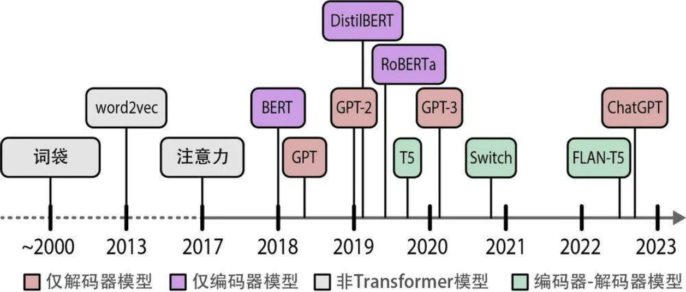
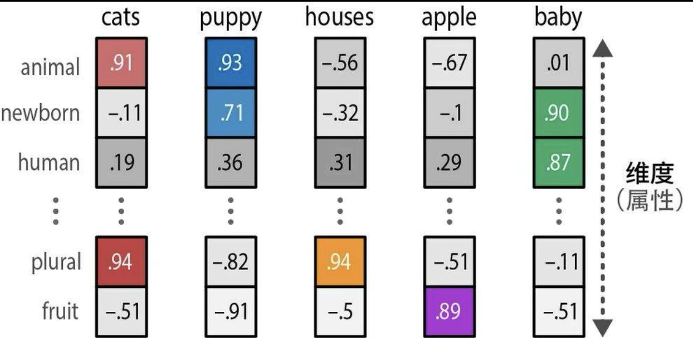
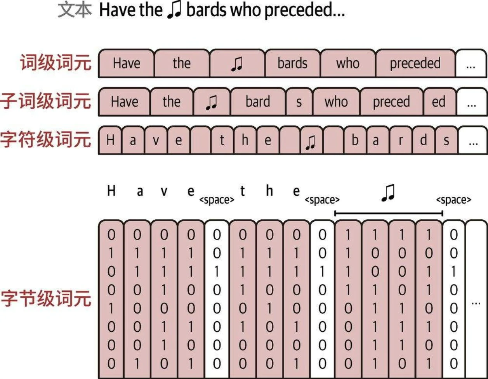

## 语言人工智能发展历史简介

### 词袋

语言人工智能历史始于一种名为词袋(bag-of-words)的技术，其工作原理如下：

1. 分词(tokenization)，即将句子拆分成单个词或子词（词元，token）

2. 将每个句子中所有不同的词组合起来，创建一个可用于表示句子的词表(vocabulary)

3. 使用词表，我们只需计算每个句子中词出现的次数，就创建了一个词袋

### word2vec

word2vec（词向量）于2013年发布，是首批成功利用嵌入 (embedding)这个概念来捕捉文本含义的技术之一。嵌入是数据的向量表示，试图捕捉数据的含义。为此，word2vec通过在大量文本数据（如整个维基百科）上训练来学习词的语义表示。

我们首先为词表中的每个词分配一个向量嵌入，比如说每个词有50个随机初始化的值。然后在每个训练步骤中，我们从训练数据中取出词对(pairs of words)，用模型尝试预测它们是否可能在句子中相邻。在训练过程中，word2vec会学习词与词之间的关系，并将这些信息提炼到词嵌入中。如果两个词各自的相邻词集合有更大的交集，它们的词嵌入向量就会更接近，反之亦然。

词嵌入可以用多种属性来表示一个词的含义。由于嵌入向量的大小是固定的，这些属性需要经过精心选择，以构建用来代表词的“心智表征”的抽象表示。在实践中，这些属性通常相当抽象，很少与单一实体或人类可识别的概念相关。然而，这些属性组合在一起对计算机来说是有意义的，是将人类语言转换为计算机语言行之有效的方式。

### 嵌入的类型

* 文档嵌入（词袋）
* 句子嵌入
* 词嵌入（word2vec）
* 词元嵌入

### 注意力机制（Attention）

例如通过 RNN 来进行翻译。这种上下文嵌入方式存在局限性，因为它仅用一个嵌入向量来表示整个输入，使得处理较长的句子变得困难。

注意力机制通过选择性地聚焦于句子中最关键的词，来突出其重要性。

通过在解码步骤中添加这些注意力机制，RNN可以为输入序列中的每个词生成与潜在输出相关的信号。这并不仅仅是将上下文嵌入传递给解码器，而是传递所有输入词的隐藏状态。

### Transformer

2017年发表的著名论文“Attention is All You Need”首次探讨了注意力机制的真正威力，以及驱动LLM展现出惊人能力的核心所在。作者提出了一种被称为Transformer 的网络架构，它完全基于注意力机制，摒弃了此前提到的RNN。与RNN相比，Transformer支持并行训练，这大大加快了训练速度。

在Transformer中，编码和解码组件相互堆叠。这种架构仍然是自回归的，每个新生成的词都被模型用于生成下一个词。

### 表示模型：仅编码器模型

原始的Transformer模型是一个编码器-解码器架构，虽然非常适合翻译任务，但难以用于其他任务，比如文本分类。
2018年，研究人员提出了一种名为BERT（bidirectional encoder representations from Transformers，基于Transformer的双向编码器表示）的新架构，它可以应用于各种任务，并在未来几年成为语言人工智能的基石。BERT是一个仅编码器架构，专注于语言表示。

### 生成模型：仅解码器模型

与BERT的仅编码器架构类似，2018年出现了一种用于处理生成任务的仅解码器架构—— GPT（生成式预训练Transformer，现在被称为GPT-1，以区别于后续版本）。GPT因其生成能力而得名。它与BERT编码器堆叠架构类似，堆叠了多个解码器块。

## 词元和嵌入

分词器如何分解文本：

* 流行的方法包括字节对编码（BPE，byte pair encoding，广泛用于GPT模型）和WordPiece（用于BERT模型）。
* 分词器需要在特定数据集上进行训练，以建立能最好地表示该数据集的词表。
* 分词器处理输入（输入文本转为token id）和输出（token id转为输出）。

分词方案：

## LLM 的内部机制

* 模型并不是一次性生成所有文本，而是一次生成一个词元。每个词元生成步骤都是模型的一次前向传播（在机器学习中，前向传播指的是输入进入神经网络并流经计算图，最终在另一端产生输出所需的计算过程）。
* 在生成当前词元后，我们将输出词元追加到输入提示词的末尾，从而调整下一次生成的输入提示词。
* 当前的Transformer模型对一次可以处理的词元数量有限制，这个限制被称为模型的上下文长度。一个具有4K上下文长度的模型只能处理4000个词元。
* 在生成第二个词元时，我们只是简单地将输出词元追加到输入的末尾，然后再次通过模型进行前向传播。如果模型能够缓存之前的计算结果（特别是注意力机制中的一些特定向量），就不需要重复计算之前的流，而只需要计算最后一条流了。这种优化技术被称为键-值(key-value，KV)缓存，它能显著加快生成过程。

