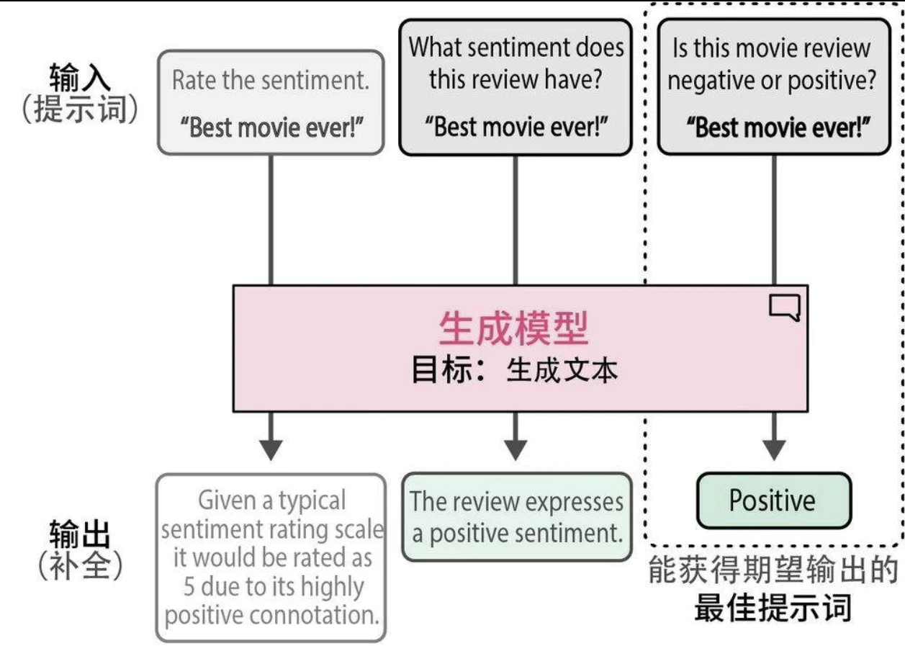
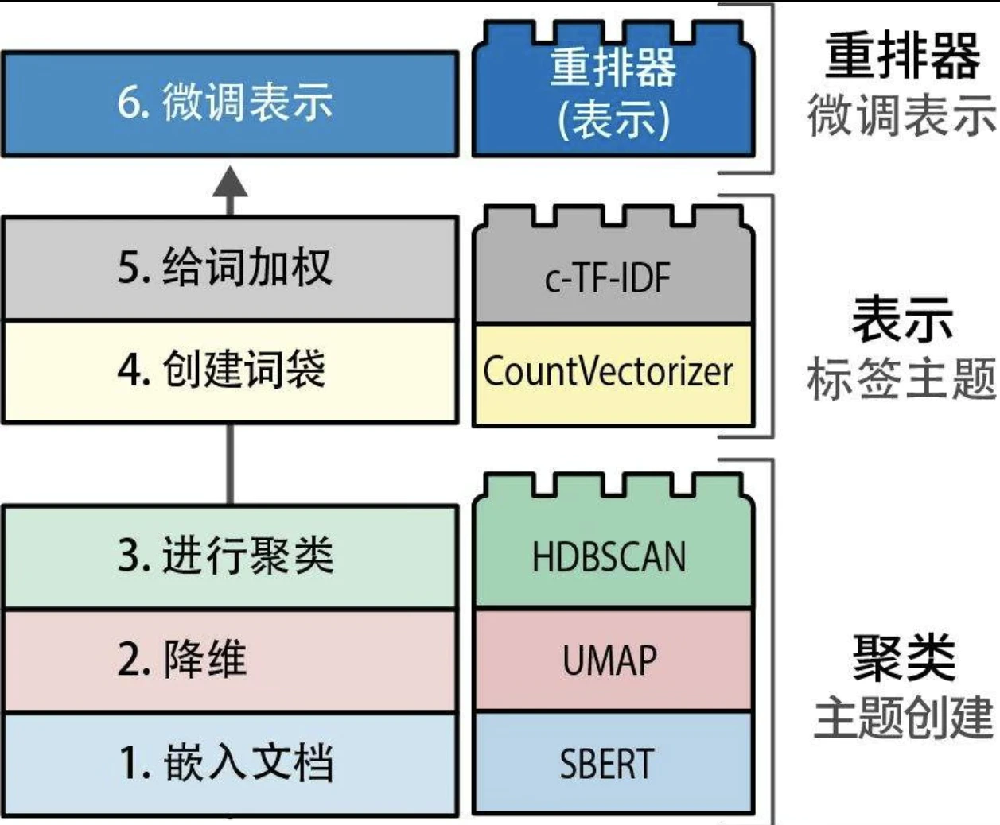

## 文本分类

表示模型和生成模型都可用于分类，但它们的方法不同。

### 使用表示模型进行文本分类

使用特定任务模型直接进行分类，或使用通用嵌入向量间接进行分类。

* 使用特定任务模型分类：例如 Twitter-roBerta-base for Sentiment Analysis 模型做情感分析。
* 使用嵌入向量分类：
  * 监督分类：
    * 第一步：使用嵌入模型将文本输入转换为嵌入向量
    * 第二步：将这些嵌入向量将作为分类器的输入特征
  * 零样本分类（zero-shot classfication）
    * 计算文档-标签对的余弦相似度
    * 使用余弦相似度来检查给定文档与候选标签的相似程度，并选择与文档相似度最高的标签

### 混淆矩阵

* 精确率(precision)衡量模型识别出的结果中有多少是相关的，用来评估相关结果的准确性。
* 召回率(recall)指的是所有相关类别中有多少被成功识别出来，用来评估模型找到所有相关结果的能力。
* 准确率(accuracy)指的是模型在所有预测中做出正确预测的比例，用来评估模型的整体准确性。
* F1分数(F1 score)平衡了精确率和召回率，用于衡量模型的整体性能。

### 使用生成模型进行文本分类

我们需要帮助模型理解上下文，并引导它得出我们想要的答案。这种引导过程主要通过给模型输入指令或提示词来完成。迭代改进提示词以获得期望的输出的过程被称为提示工程(prompt engineering)。

## 文本聚类

### 文本聚类的一般步骤

1. 使用嵌入模型(embedding model)将输入文档转换为嵌入向量。

2. 使用降维模型(dimensionality reduction model)将嵌入向量降至更低维度空间。

3. 使用聚类模型(cluster model)对降维后的嵌入向量进行聚类。

### 降维

* 随着维度的增加，每个维度中可能的取值数量呈指数级增长，在每个维度中寻找所有子空间变得越来越复杂。
* 降维是一种压缩技术，其底层算法并不是随意删除维度这么简单。
* 降维算法：
  * 主成分分析(Principal Component Analysis，PCA)
  * 统一流形逼近和投影(Uniform Manifold Approximation and Projection，UMAP)

### 聚类算法

* 基于质心，例如 k-means，需要生成一组预设的簇
* 基于密度，HDBSCAN（Hierarchical Density-Based Spatial Clustering of Applications with Noise，具有噪声的分层密度空间聚类）。HDBSCAN是聚类算法DBSCAN的层次化变体，它无须显式指定簇的数量就能发现密集的（微型）簇。作为一种基于密度的方法，HDBSCAN 还可以检测数据中的离群点，即不属于任何簇的数据点。

### 主题建模

在文本数据集合中寻找主题或潜在语义的思路，通常被称为主题建模。传统上，主题建模的目标是找到一组最能代表、捕捉主题含义的关键词或短语。

主题建模技术并非将主题标记为“手语”，而是使用诸如“手势”“语言”“翻译”等关键词来描述主题。因此，结果并不是单一的标签，用户需要通过这些关键词来理解主题的含义。

经典方法，如潜在狄利克雷分配(latent Dirichlet allocation，LDA)，假设每个主题都由语料库词表中词的概率分布来表示。这些经典方法通常使用词袋技术提取文本数据的主要特征，而没有考虑词和短语的上下文及含义。相比之下，文本聚类示例则考虑了这两方面，因为它依赖基于Transformer的嵌入向量，这种嵌入向量通过注意力机制针对语义相似性和上下文含义进行了优化。

BERTopic：一个模块化主题建模框架

我们可以对词的初始分布进行重新排序，以改进最终的表示。(即 Rerank)

