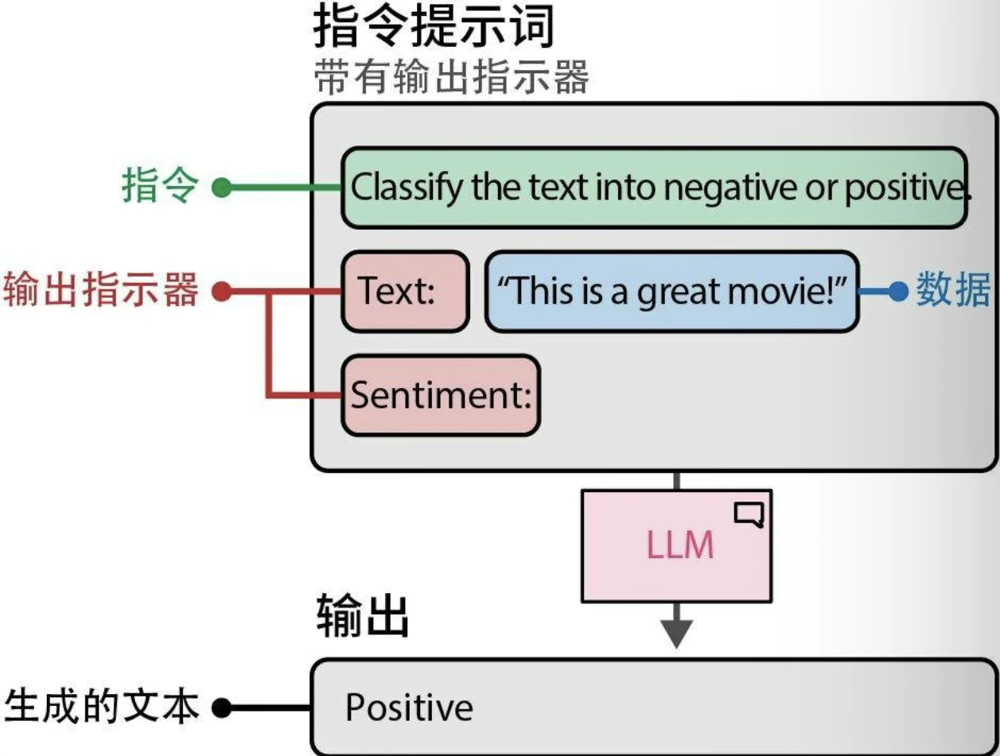
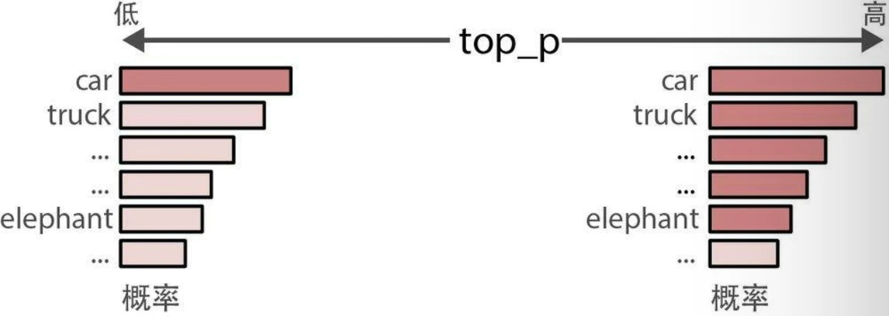
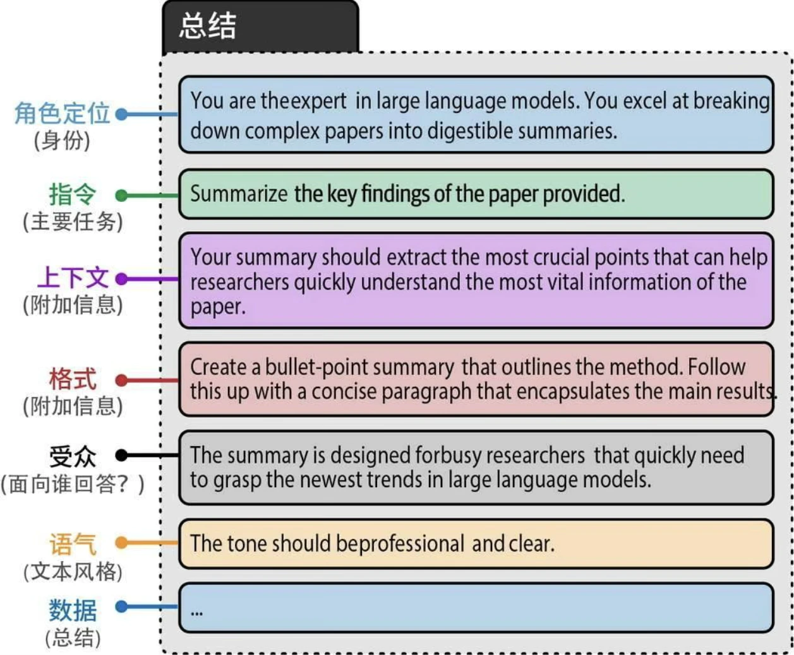
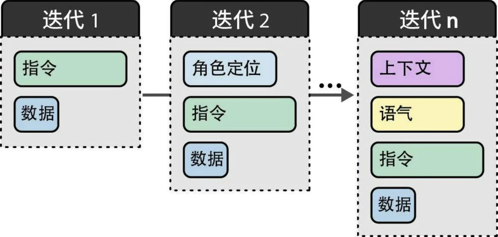
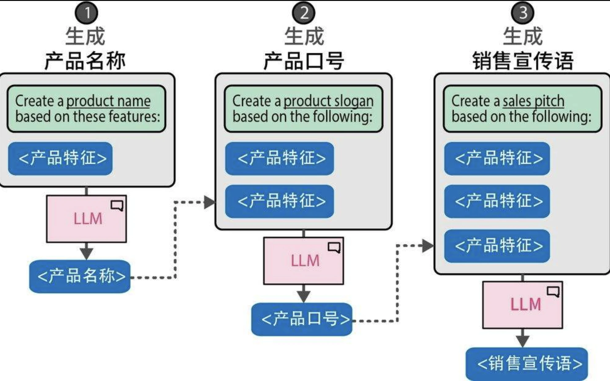
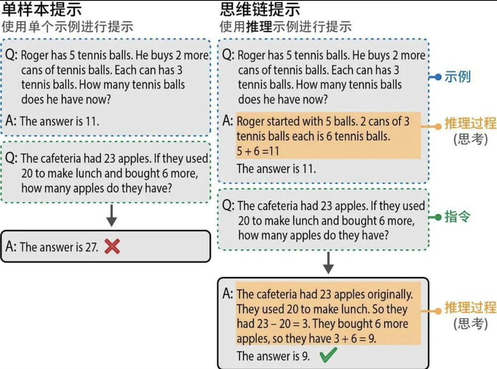
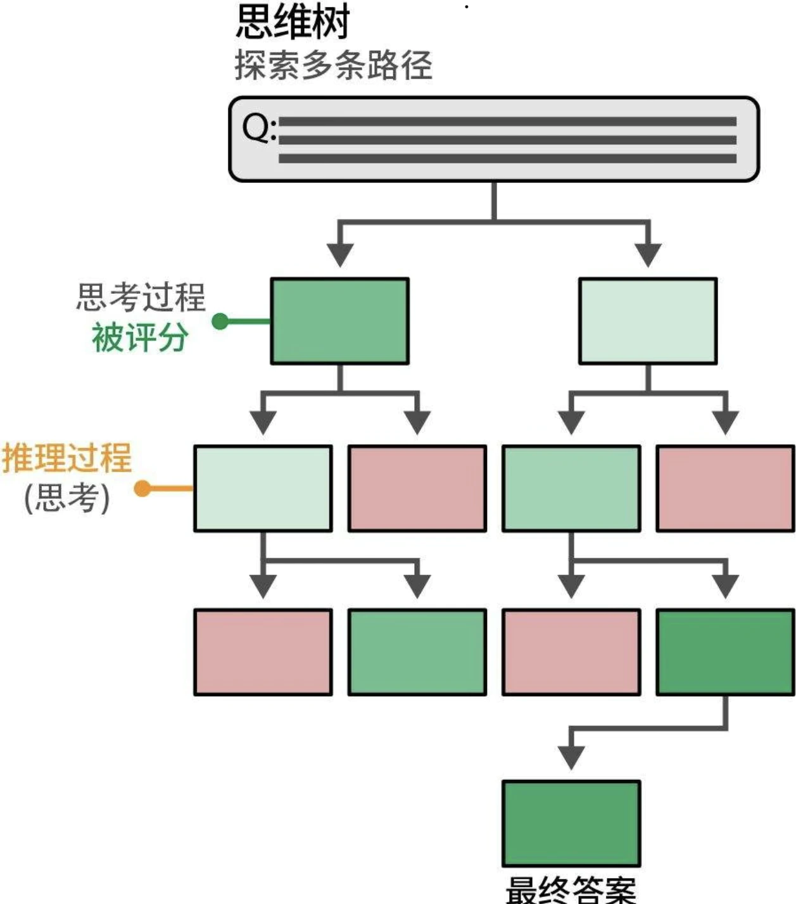

## 提示词

LLM是一个预测引擎。基于某个输入（即提示词），它试图预测可能跟随其后的词。从本质上讲，只需少数几个词，就能激发LLM做出响应。

提示词通常用于让LLM回答特定问题或解决特定任务。这称为基于指令的提示词。

## 输出参数

除了提示词，我们还可以通过调整模型参数来控制输出类型。

### temperature

temperature（温度）决定生成文本的随机性或创造性。它定义了选择本来不太可能出现的词元的概率。其基本原理是，temperature为0时每次都会生成相同的响应，因为它总是选择可能性最大的词。较高的temperature值允许生成可能性更小的词。
* 较高的temperature（如0.8）通常会产生更多样化的输出。
* 较低的temperature（如0.2）会产生更具确定性的输出。

### top_p

top-p采样，也称为核采样(nucleus sampling)，是一种控制LLM可以考虑哪些词元子集（核）的采样技术。它会考虑概率最高的若干词元，直到达到其累积概率限制。
* 如果我们将top_p设置为0.1，模型会从概率最高的词元开始考虑，直到这些词元的累积概率达到0.1。
* 如果我们将top_p设置为1，模型会考虑所有词元。

## 高级提示工程

### 提示词组件

常见组件：

* 角色定位：描述LLM应该扮演什么角色。例如，如果你想问一个关于天体物理学的问题，可以使用“你是一位天体物理学专家”。
* 指令：任务本身。指令应该尽可能具体，避免留下太大的解释空间。
* 上下文：描述问题或任务背景的附加信息。它回答了“为什么提出这个指令”这样的问题。
* 格式：LLM输出生成文本的格式。如果不指定格式，LLM会自行决定格式，这在自动化系统中会造成麻烦。
* 受众：生成文本的目标对象。这也描述了输出的水平。在教育目的下，使用ELI5（Explain like I'm 5，“向5岁的孩子解释”）通常很有帮助。 
* 语气：LLM在生成文本中应该使用的语气。如果你要给老板写一封正式的邮件，你肯定不想使用非正式的语气。
* 数据：与任务本身相关的主要数据。

对模块化组件进行迭代是实体工程的重要步骤：

### 上下文学习：提供示例

我们可以为LLM提供我们想要完成的目标任务的具体示例。这通常被称为上下文学习(in-context learning)，其中，我们为模型提供正确的示例。

* 零样本提示不使用示例
* 单样本提示使用一个示例
* 少样本提示使用两个或更多示例

### 链式提示：分解问题

将一个提示词的输出作为下一个提示词的输入，从而创建一个连续的交互链来解决我们的问题。

链式提示技术让LLM能够在每个独立问题上投入更多时间，而不是一次性解决整个问题。

## 推理

### 思维链：先思考再回答

在提示词中提供了一些示例，展示了模型在生成响应之前应该进行的推理。这些推理过程被称为“思考”。这对于涉及较高复杂度的任务（如数学问题）帮助很大。添加这个推理步骤使模型能够在推理过程中充分利用更多的计算资源。相比于基于几个词元直接计算出完整的答案，在推理过程中每增加一个词元都能让LLM的输出更稳定。

虽然思维链是一种增强生成模型输出的好方法，但它需要在提示词中包含一个或多个推理示例，而用户可能无法获取这些示例。我们也可以不提供示例，而是直接要求生成模型进行推理（零样本思维链）。这种方法有多种形式，一种常见且有效的方法是使用“让我们逐步思考”(Let's think step-by-step)。

### 自洽性：采样输出

用相同的提示词向生成模型多次提问，并将占多数的结果作为最终答案。在此过程中，可以通过调整不同的temperature和top_p值来影响每个答案，以提高采样的多样性。

### 思维树：探索中间步骤

思维树(tree-of-thought，ToT)可以对多个想法进行深入探索。工作原理如下：当面对需要多个推理步骤的问题时，将其分解成多个部分通常会有所帮助。在每个步骤中，生成模型会被提示探索当前问题的不同解决方案。然后，它对最佳解决方案进行投票，并继续进行下一步。

## 输出验证

三种控制生成模型输出的方法。

* 示例：提供多个预期输出的示例。
* 语法：控制词元选择过程。
* 微调：在包含预期输出的数据上对模型进行微调。

### 语法：约束采样

用于约束和验证生成模型输出的软件包：Guidance、Guardrails、LMQL等。在某种程度上，它们利用生成模型来验证自己的输出。生成模型将输出作为新的提示词，并尝试基于一些预定义的规则进行验证。

