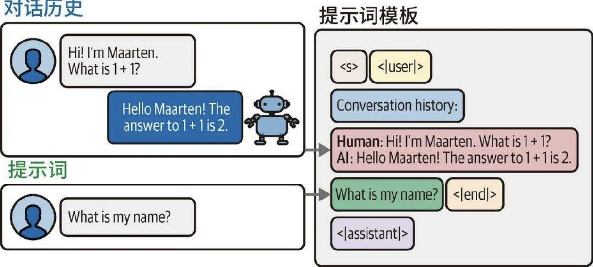
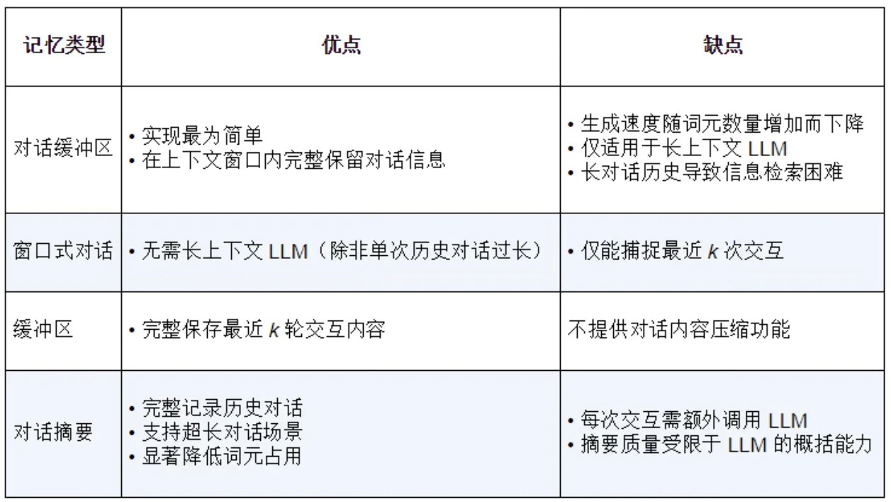
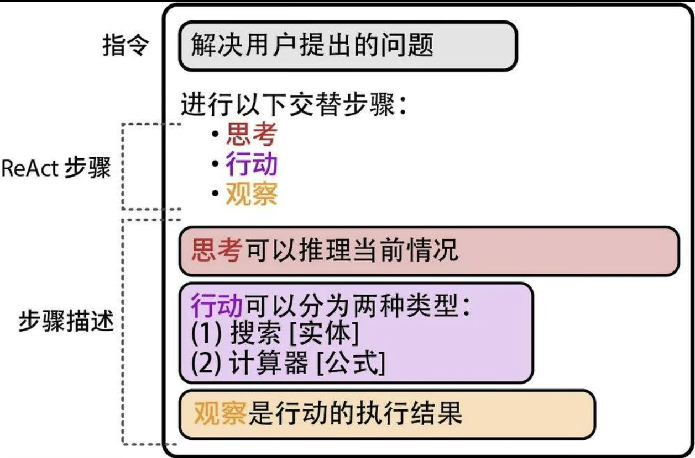
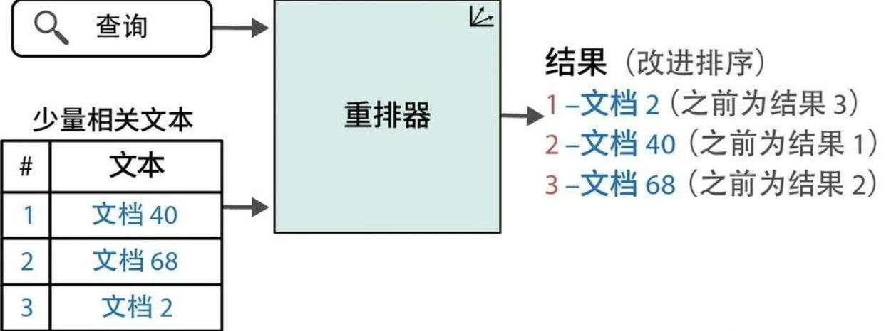
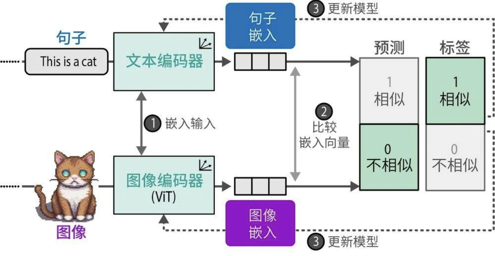

## 记忆

直接使用未经定制的LLM时，系统默认不具备对话记忆能力。即使在前序提示词中告知模型用户的姓名等信息，模型也无法在后续对话中记住这些信息。

两种广泛应用于对话记忆保持的方法：
* 对话缓冲区
* 对话摘要

### 对话缓冲区

* 随着对话轮次增加，输入提示词的文本长度会持续增长，最终可能超出模型的词元限制。
* 控制上下文窗口的有效策略是仅保留最近k轮对话记录。

### 对话摘要

* 对完整对话记录进行摘要提炼，保留核心信息。
* 提炼摘要的过程由另一个LLM完成：该模型接收完整对话历史作为输入，并负责生成简明的摘要。使用外部LLM的显著优势在于，对话系统无须局限于单一模型。

### 对比

## Agent

能够自主规划行动及其序列的系统被称为智能体(agent)，其核心在于利用语言模型自主制定行动决策。Agent 通过两大核心组件实现功能扩展：
* 工具(tool)：赋予智能体完成自身无法独立处理的任务的能力。
* 智能体类型(agent type)：规划行动及工具使用策略的决策框架。

ReAct的精妙之处在于建立了推理与行动的动态反馈机制：推理指导行动决策，行动结果“反哺”推理进程。在具体实现中，系统通过以下三阶段的循环迭代完成认知闭环：
* 思考(thought)
* 行动(action)
* 观察(observation)

## 语义搜索与RAG

语义搜索(semantic search)核心在于通过语义理解而非简单的关键词匹配来实现精准检索。

尽管模型能够流畅自信地输出答案，但其内容在准确性和时效性方面仍存在不足（幻觉）。解决该问题的主要方法之一，便是构建能够实时检索相关信息并输入LLM的系统，从而生成有事实依据的答案。这种被称为RAG（检索增强生成）的技术，现已成为LLM最受瞩目的应用场景。

优化语言模型在搜索领域的应用，当前主流技术可分为三大类：
* 稠密检索(dense retrieval)
* 重排序(reranking)
* RAG

### 稠密检索

基于文本嵌入，将搜索问题转化为查询向量与文档向量的最近邻匹配过程。如图所示：接收搜索请求后，系统在文档库中进行向量比对，最终输出相关性最高的结果集合。

### 重排序

搜索系统多采用多阶段处理流程。重排序模型作为其中关键环节，负责对初步检索结果进行相关性评分，并据此优化排序。

### RAG

生成式搜索属于广义的RAG系统范畴。这类系统通过整合检索机制来增强文本生成功能，可有效抑制幻觉现象、提升事实准确性，并使模型输出与特定数据集保持逻辑一致性。

## 多模态LLM

### 视觉Transformer

视觉Transformer(Vision Transformer，ViT)的实现依赖Transformer架构的一个重要组件——编码器。不同于将文本分割为词元，它将原始图像切割为规则排列的图像块，进而实现特征提取。

但需注意，无法像文本词元那样直接赋予图像块固定的ID——由于图像的多样性，图像块在不同场景中的重复概率远低于文本词元。
为解决这一问题，系统会对图像块实施线性嵌入操作，将其转换为数值化的嵌入向量。当嵌入向量进入编码器后，视觉与文本模态的处理路径完全相同。

### 多模态嵌入模型

多模态嵌入模型可在同一向量空间中为不同模态生成嵌入向量。

得益于共享向量空间的特性，我们可以直接比较不同模态的语义表示。

在众多多模态嵌入模型中，对比语言-图像预训练(Contrastive Language-Image Pre-training，CLIP)模型以其卓越的性能和广泛的适用性成为当前最主流的解决方案。

CLIP的实现逻辑相当简洁。设想存在一个包含数百万张图像及其对应描述文本的训练数据集，该数据集为构建跨模态对齐提供了基础。基于此数据集，可为每一组图像和描述文本创建两个向量表示。CLIP采用双编码器架构实现这一点：文本编码器处理描述文本，生成语义嵌入；图像编码器提取视觉特征，生成图像嵌入。如图所示，经过联合训练后，配对的图文数据将在向量空间中获得高度对齐的嵌入向量表示。

