## 设备

- 网络
  - 路由器: 小米路由器 BE6500 Pro
  - 交换机: 小米万兆交换机
- 存储:
  - NAS: Synology DS220+ (2*16T, RAID1)
- 计算:
  - MiniServer: M4 MacMini (24G+256G)
  - DevServer: 零刻 SER8 8745HS 迷你主机 (32G+1T)

## 基本原则

核心理念:

* 配置简单
* 运行稳定
* 对网络暂无特别高的要求

设备角色：

* NAS 尽量只做存储使用，不部署其它不必要的服务
* MiniServer 作为生产环境，部署需要长期稳定运行的服务
* DevServer 作为开发环境，用于平时开发测试，以及部署一些临时服务
* MiniServer 同时承担网关角色，统一流量入口

## 网络

### 网络拓扑



### 内网 DNS

出于部署方便，直接在 MiniServer 上 docker 部署了 [AdGuard Home](https://adguard.com/en/adguard-home/overview.html)

```shell
docker run -d \
  --name adguardhome \
  --restart unless-stopped \
  -v ./work:/opt/adguardhome/work \
  -v ./conf:/opt/adguardhome/conf \
  -p 53:53/tcp \
  -p 53:53/udp \
  -p 3000:3000/tcp \
  adguard/adguardhome:v0.107.71
```

然后：

1. 将路由器的 DHCP 配置中，DNS 配置修改为 MiniServer 的 IP（修改第一个 DNS 配置，第二个保留为运营商的配置作为兜底）
2. AdGuard Home 中设置 DNS Rewrite，将自己的内网域名 A 记录（`@` 和 `*`）配置为 MiniServer 的 IP

例如：

* MiniServer IP 为 `192.168.31.2`，自定义内网域名为 `myhomelab.com`（仅作为示例）
* 路由器 DHCP 的 DNS 配置为 `192.168.31.2`
* AdGuard Home 中设置 `myhomelab.com` 和 `*.myhomelab.com` 为 `192.168.31.2`

这样后续就可以通过自定义的域名来访问内网服务了。

### 异地组网

使用 [Tailscale](https://tailscale.com/)。

1. 在 MiniServer 以及需要远程访问的设备上安装 Tailscale
2. 之前自定义内网域名为 `myhomelab.com`，同时也购买了公网域名
3. 在域名提供商解析域名 `myhomelab.com` 的 A 记录（`@` 和 `*`），IP 使用 tailscale 提供的 `100.x.y.z` 地址

这样内外网都可以统一通过域名来进行访问。

## 服务

| 服务 | 部署形态 | 部署位置 |
| ---- | ------ | ------- |
| Jellyfin | 直接部署 | MiniServer |
| AdGuard Home | Docker | MiniServer |
| Traefik Proxy | k8s | MiniServer |
| Gitea | k8s | MiniServer |
| Grafana | k8s | MiniServer |
| Prometheus | k8s | MiniServer |
| 其它开发相关 | 直接部署/docker | DevServer |

## 效果

使用 [homepage](https://gethomepage.dev/) 部署了个首页导航，效果如下：


